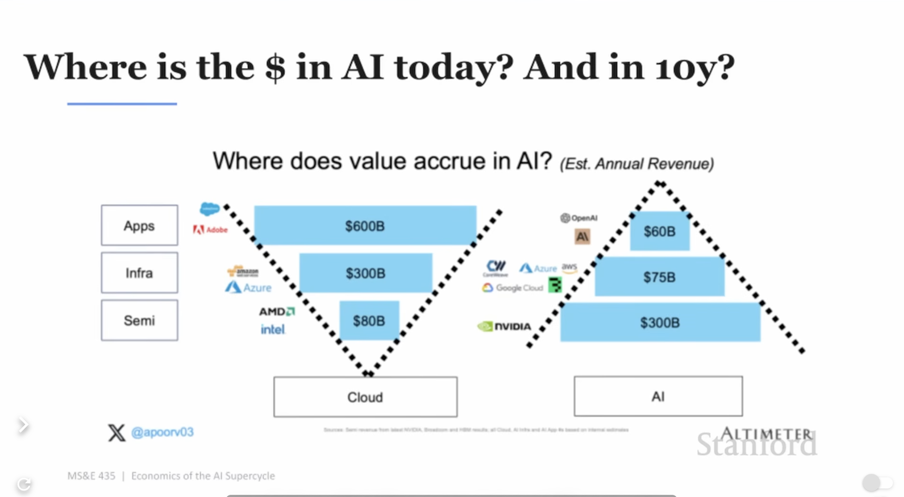
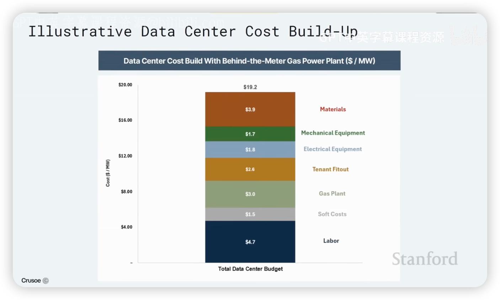
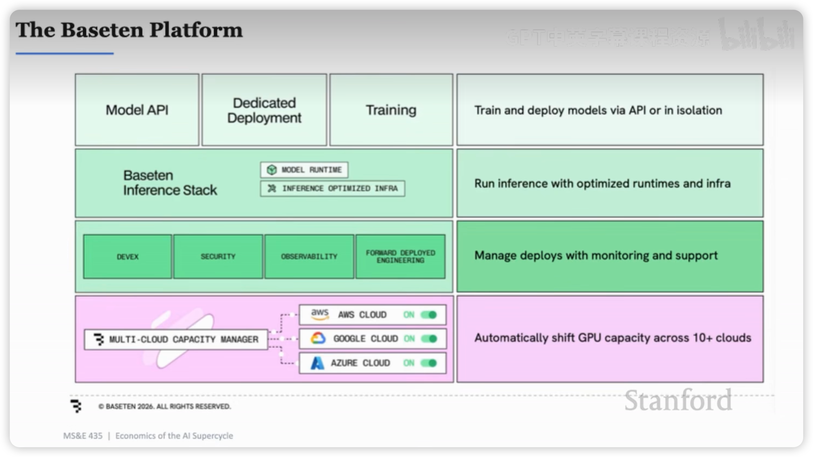

# [Stanford MS&E 435-Economics of the AI Supercycle](https://youtu.be/LNSvp-9b-J0)

## AI行业里钱怎么流动？

1. AI和互联网、云计算之间的最大差别是，软件的运行成本几乎可以忽略（毛利率大于80%的软件公司比比皆是），而AI使用的越多，消耗的算力越多，成本越高。
2. 2026Q1英伟达的财报会议提到，售出的GPU约40%用在推理，60%用在模型训练。假设，用于推理的GPU不断增加，能否代表AI发展已经走到了更成熟的应用层？
3. 在AI这个三角里，毫无疑问，半导体是最赚钱的，大约75%毛利率。AI应用层，毛利率在0-30%之间。2024-2026这两年里，AI营收翻了5倍，但三角形的结构未曾改变，三角形被等比放大了，钱都流向了半导体。
4. Infra层负责把AI的能力包装好提供给企业用户和个人用户。这一层竞争最激烈，以大型云计算厂商AWS、GCP、Azure、阿里云为首，不仅有来自于纵向的竞争，还有初创公司这类横向的竞争。关键之处在于，提供的是一个功能 还是 一个平台。
5. 当前ChatGPT的用户量突破了10亿，相比WhatsApp30亿的规模，还有很大的差距。所以，知识型工作是每个人都做的工作吗？

## The GPU Economy

1. 从2000年开始，科技所占全球GDP的5%跃升到13%，未来几年这个比重还会增加。
2. Groq通过SRAM优化了GPU在decode阶段KV Cache的存储和读取效率，大幅提升了推理吞吐量。
3. 数据中心的输入是电力+芯片，输出是token。
4. token会不会越来越便宜？取决于推理效率优化、需求增长速度和模型大小。
5. 智商会被商品化，情商会变得更加有价值。说服别人的能力、建立团队的能力、把人带向不同方向的能力。

## Building AI Factory：Crusoe

1. 影响GDP 的一个关键因素是劳动力的数量。Agent 的出现，增加了无数的数字劳动力，Agent做 PPT、写文档、整理表格、写代码等等。所以AI会提高生产力，推动GDP的增长。
2. 数据中心的选址思路是搬运数据，但不搬运能源，选能源多的地方。风能、太阳能、温度这些指标对于选址都非常重要。参考，国内的数据中心在鄂尔多斯。
3. 建设一兆瓦的数据中心，需要6000万美元的资本开支，3000万用于购买GPU，其次，劳动力成本占比最高，大约为 470万 美元，美国现在大量缺水电工、焊工、建筑工人。时薪仍在不断提升。
4. 燃气发电厂越建越多，生产燃气轮的厂商稀少并且产能很难提高，像GE Vernova，原本100万的燃气轮卖到300万，依然供不应求。
5. 电力运输、电力设备元器件的成本高，一定会有很多创新来解决这个问题。
6. 开源模型会抢占闭源模型的市场份额。
7. SpaceX想把数据中心建在太空，技术上完全没问题，省去了混凝土、散热、电力的麻烦，所有的通信都依赖光。但是运营是个大问题，数据中心的运营依赖人去做线缆的插拔、更新、修理。除非，把人力运输的成本降低1-2个数量级。预测5年甚至10年，不会有大规模的太空数据中心。

## Databricks老板对谈

1. AGI的前提是要把人类的所有信息告诉AI，本质上是把脑中的信息放到芯片里。
1. 因为大模型的强大，很多人都觉得我们已经实现了AGI。但是目前AI并没有给生产力带来明显的提升。这就像，造了一个超强的大脑，但是旧的身体和大脑不匹配一样。下一步，就是重建整个身体。
1. Databricks and Hamilton Helmer分别是什么？
1. AI应用层仍会是最有“钱”景的，AI+医疗、AI+教育，会有大量的机会，因为人们会非常慷慨的为健康和教育买单。
1. 模型厂商面临开源模型的冲击，预测未来利润率很低，也许是门“苦生意”。
1. 长远地思考，不焦虑于眼前的热点和很厉害的东西。亚马逊的出发点很简单，判断未来会是互联网时代-> 也许人们会在网上买东西，先从流通稳定的书开始，然后不断的修正迭代，拓展到全品类，成为亚马逊。这种简单的思考方式也适用于AI时代。

## 英特尔前CTO、OpenAI工业计算负责人Sachin

1. 英特尔的优势：能制造芯片而不仅仅是设计、CPU在回暖；
2. 现在负责为OpenAI提供算力支持，模型公司的收入主要就是追踪算力、用户量、token量这几个指标；
3. 预测未来模型推理消耗的算力占比大于80%，数据中心会造更多的钱； 
4. 目前token价格太贵了，未来会从三个维度降低这个价格。优化硬件和软件让token生成消耗更少的算力、提升模型能力让token更智能、改进harness降低每个任务消耗token数量；
5. 1吉瓦的算力大概由50万枚GPU组成；
6. 异构计算（GPU+CPU+AI加速器）才能给用户带来好的体验，根据不同任务和场景分配不同算力资源；
7. TTFT（Time To First Token）主要是指prefill阶段的耗时，大概在400-500毫秒之间。app把prompt转成token发送到云端并负载均衡到合适的GPU大概只有几十毫秒；
8. 当前，模型训练和AI Infra是解耦的，模型训练好了之后，才去找什么样的芯片和系统设计能够最高效运行这个模型。效率非常低。所以期望在模型训练的时候，就确定Infra如何设计，这也是RSI的思路；
9. 芯片从设计到实际生产，要大概3年的时间；
10. 看多：美国基础设施建设，原因是美国人已经忘记了怎么建设大规模的基础设施，从简单的发电站、变压器、冷却系统、电池开始，更不要说微电子、集成电路了。并且，大型、技术型基础设施有壁垒，别人很难复制。最后还提了一句，让斯坦福大学学生往电子、电气方向规划；
11. 看空：任何模型套壳类产品，大量的APP产品。“如果未来以结果的形式与计算交互，还需要一个APP界面吗？”
12. 前沿模型还是会消耗更大数量级的算力。

## Model相关

1. AlexNet证明了不需要人工设计特征，凭借大量的数据，神经网络可以自动学习特征，于是深度学习可以用来解决现实世界里（很多无法设计特征）的问题。此外，随着算力、数据、参数的提升，预测准确率是越来越高的。
2. Transformer架构让大规模训练成为可能。scaling laws在训练模型的时候，被用来根据模型大小预测性能和规划算力资源；
3. 一句话理解推理模型的能力怎么来的：大规模 RL 让模型学会了一套更容易获得高 Reward 的“推理策略”，而这些策略恰好包括拆解问题、尝试不同路径、检查错误、修正答案等能力。
4. COT（Chain of Thought）完全是模型涌现出来的行为。推理模型是ClaudeCode和CodeX这类Agent表现如此出色的底层原因之一；
5. Test Time Compute也存在扩展定律；
6. Continual learning，从现实问题中学习，反馈更强更直接，数据高效。这是目前模型发展的瓶颈之一；
7. 现在模型通过reward的方式训练，Evals就是根据自己的业务定义好坏；
8. Applied Compute这家创业公司，做的就是AI在企业的落地，感觉国内也很快有这样的公司出现，可能已经有了。有一点反直觉的，对于未来模型迭代可能解决的问题，企业端也需要做一个“临时版”，因为企业端希望时刻保持前沿，此外，不认为通用模型能解决所有长尾问题；
9. 以DeepseekV3和R1为例，RL占训练比例的5%，但这个数字在不断上升。毫无疑问，做更多RL，模型有更好的表现；
10. 现实业务里，往往是多个模型的组合，协同解决问题，例如有通用模型，也有为了解决特定场景的专用模型，这样才是一个高效、鲁棒性强的系统；
11. 应该有更好的硬件和芯片来优化模型训练；
12. 看多英伟达，看空数据制造商，因为模型越智能，合成数据越厉害；

## 推理服务 初创公司 BaseTen

BaseTen服务的是无法做专用模型训练、推理、运维的企业客户，为此提供模型的推理部署服务，优势是更快、更稳定、可观测。

1. 一个企业专用模型，随时可能被前沿模型的更新给替代掉，既然如此，为什么企业还要开发自己的大模型？原因超乎意料。有的企业就靠几个工作流和私有数据来赚钱，如果这部分工作流和数据被前沿模型吸纳，那这个企业就没有价值了。所以，训练自己的大模型，也是保护自己的一种方式。PS：企业训练模型，一般都是基于开源模型 做后训练。
2. 越大规模的企业，越希望训练自己的模型，建立自身的智能，而不是做token交易员。
3. BaseTen的工作流：客户定义场景和诉求->提供对应数据->选择开源模型->通过BaseTen的脚手架得到预训练模型（BaseModel）->BaseTen核心框架：基于数据和BaseModel得到效果非常好的后训练模型->部署->用户调用。
4. BaseTen的两大赌注是：AI应用层需求源源不断+开源模型能力不断进步；
5. 英伟达的优势是完善的供应链、CUDA及生态（非常依赖）、与TSMC关系好（能分到晶圆）；
6.  之前的推理过程（Prefill和decode）都试图在一个芯片上完成，直到英伟达收购了Groq。所以，现在涌现了很多芯片都在试图分解推理过程，尤其是decode阶段。虽然各种芯片、异构计算百花齐放，但目前英伟达还是无敌。 
7. 为什么租算力？因为判断推理层有非常高的价值，能给用户带来最大的黏性，所以聚焦于此。此外，实际算力供应比宣传的短缺要严重10倍。比如在2026年5月份提出需要1000块GPU，那至少是2027年Q2的事情。
8. Agent越来越普遍，模型越来越大，这两点会导致推理需求变得更多。
9. 模块化算力，是一个很好的课题，想加多少加多少，而不是总是搞数据中心。 
10. 算力交易非常像毒品交易。公司里有个人天天坐在角落里打电话，问哪里有算力。这比喻太绝了 

## Vercel创始人-AI Coding

1. AI Gateway就是面向token的CDN，token可以来自Anthropic、Deepseek等等，token需要被观测、故障转移、被保护、加速和缓存，因此可以通过AI Gateway完成负载均衡。
2. Agent的sandbox就是一台计算机，就像新人刚入职一样，发给他一台电脑，预置了一些软件，让他随便去折腾。
3. Vercel提供Agent部署在云端的能力，Agent时代的AWS。例如，一个Notion Agent正在转录一场讲座，这个Agent就是部署在Vercel上的。
4. SaaS软件，往往是一群很聪明的人（产品经理、设计师）聚在一起，讨论什么样的设计最通用、能获得最多的用户满意？（关于这一点，我有深刻体会）这是最大公约数软件，最好的软件一定是量身定制的。现在，Vercel上面软件/Agent百花齐放。
5. Tailwind虽然让代码看起来像垃圾一样混乱，但是它对AI友好（局部推理），很多年前Vercel就押注这里。
6. 要让大模型有用，它需要一个sandbox，需要一个部署平台（Agent部署）、需要一个域名（产品/应用的域名），这个想法落地就成了Vercel

## 完结篇：生命科学+AI

1. 业界希望通过AI来加速生命科学的研发，例如制药，一种药物从开始到上市的完整流程，大约要10-15年；
2. 制药的核心是，找到一个能在患者身上产生效应的分子。但完整流程非常复杂，首先要确定目标群体和疾病，定义target（瞄准体内的某个蛋白质分子）；接着确定药物类型（抗体/小分子/基因/新模态），开发药物，这一步大概要花费4年的时间；随后得到候选药物，锁定工艺，拿到FDA许可；最后开启3期临床实验，安全、观察疗效、最终验证，都通过后拿到最终FDA许可，这一步大概要6-9年时间。
3. 预计未来几年内，可以将制药周期缩短到最多5年；
4. 探索多种模态的药物，不局限于抗体；扩大高质量新靶点的发现；设计更复杂的药物；
5. 未来看好增肌药（与GLP减肥药一起使用+医疗用途）和帮助人睡得更好的药物，两者都属于消费品药物，受众群体广；
6. 看多制药企业（药物研发快，赚更多的钱）和可扩展的AI原生制药实验室（例如Plasmidsaurus、Adaptive、Twist），看空向制药企业提供工具的公司；
7. AI怎么连接湿实验室，可能有一些可以产品化的
