# 前言

此刻，写下这篇旅行日记的时候，我已经坐在工位准备 2025 年度的 工作review 了。回国三天，澳洲的记忆和感受正在变得模糊。我突然意识到，如果我不用文字记录下来，总有一天，只有照片和护照记得我曾经去过那里。我还是想留下点什么，日记也许是最好的记录方式。    ---2026.01.06

# 一切的起点

2025 年，是我正式工作后第一个完整的一年，打工打得心累。想趁岁月静好，带着自己这颗鲜活、好动的心出去走走，看看世界。凑巧，2026 年的元旦可以请 3 休 8，于是规划去南半球再过过夏天，吹吹海风、看看可爱的小动物，那么，澳大利亚，我来了！

## 走出亚洲

我第一次迈出国门，是去了东亚邻国---日本。从沈阳飞到大阪只要 2.5h，再加上日本满大街的“汉字”，这段旅程总让我心里打起嘀咕，“这也叫出国？”出国给我的刻板印象是，一定要离家足够远，带几个大包行李，街上都是不熟悉的面孔。很好，澳洲完美地满足了我的刻板印象。

出发当天是工作日，所以买了晚上 8 点 50 中转海口再飞悉尼的航班，在海口要停留 2 个小时。海口美兰机场室内、室外都种了各种各样的绿植，小岛的海风拂面过来，让我从紧绷的工作中放松下来。海口飞悉尼，一共是10 小时的飞行时间，我特意准备了 u 型枕、一次性拖鞋、足够的手机电量、下载好的《权利的游戏》第四季。第一次坐大型客机，海航波音 787 经济舱是 3+3+3 的座椅布局，宽敞舒适，我坐在靠窗的位置，中间空座，过道是一个老大爷。 起飞后一个小时，北京时间凌晨 3 点半，空姐开始发正餐，对照着菜单，我发现飞机餐才是最大的虚假宣传。

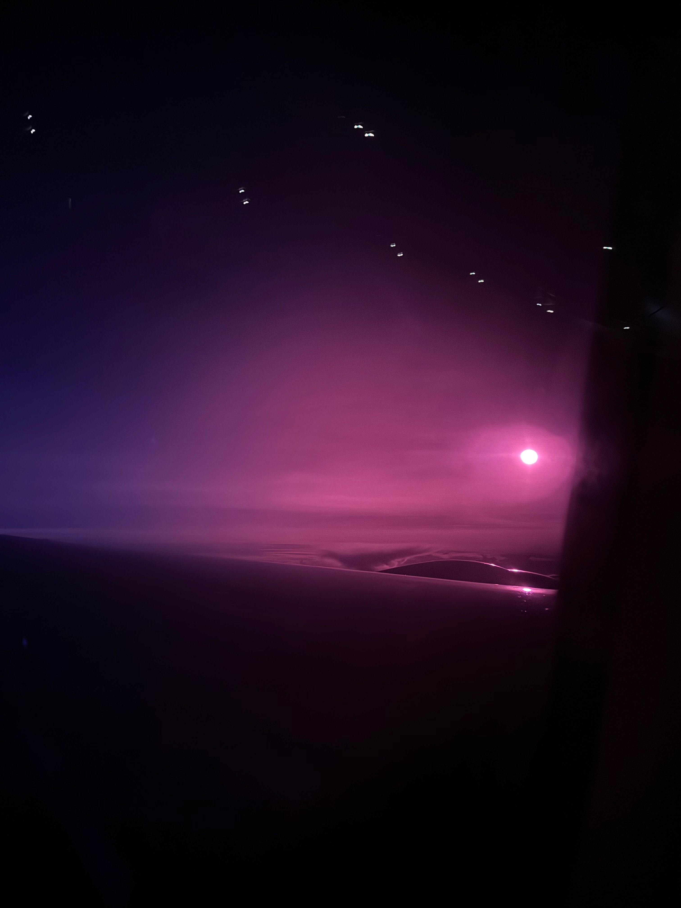

飞机不断地向前飞，跨越赤道，而我在飞机的轰鸣声中一次次入睡。天亮之后，隔壁座位老大爷让我帮他填写入境卡，他的手抖到无法写字。简单聊天后才得知，大爷原来是 49 年出生的广州人，14 年拿到了澳洲 PR，儿子在澳洲做电气生意。没想到，飞机上随机遇到的一个人就是“人生赢家”了。我们聊了很多，从广式下午茶到澳洲全民医保，大爷说自己还是喜欢呆在广州，因为牵挂儿子，每年都要在澳洲呆几个月。他还提到，他在国内资助了一个湖南大学生，从中学资助到研究生，甚至还跟我聊国内就业形势的严峻。很难想象这是一位快 80 岁的老人。下飞机前，他还祝我玩得愉快。旅行就是为了遇到和自己相同或不同的人，看看他的世界是怎么样的，再看看他是怎么看待世界的。而我一直享受着与各种各样的人沟通。

## 小插曲

落地悉尼，过海关走了人工通道，竟然被工作人员叫过去问话。来澳大利亚做什么？这边有你的亲人/朋友吗？你和他是怎么认识的？计划停留几天，返程的机票有吗？什么，你还要去墨尔本？去墨尔本玩什么？墨尔本住哪里？什么时候从悉尼去墨尔本？你的钱够支付本次旅行吗？你的工作是什么？你可以走了，祝你玩的开心。突然讲英语有些不习惯，再加上有美签面签被拒的经历，非常紧张。不过，幸好通过了，没有被遣返。没想到，海关的拷打竟然结结实实的落在我身上。

朋友早就在出口处等着我了。那么，就先从悉尼开始吧。

# 悉尼SYD

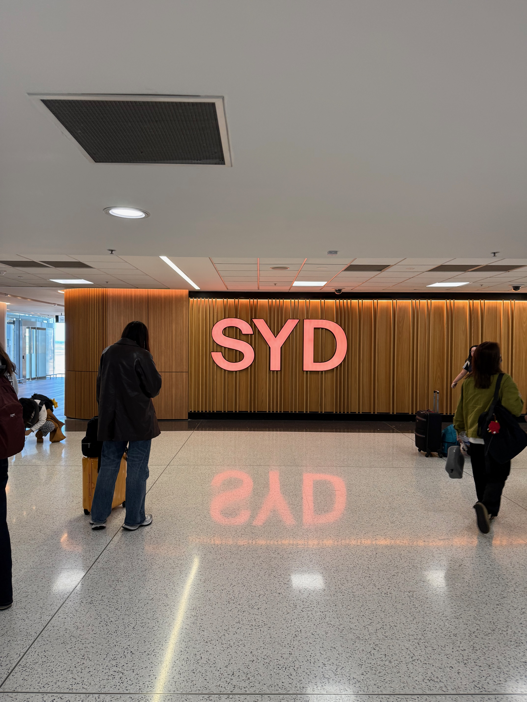

## 船

在我看来，船景是悉尼旅行最重要的一环。海景与城市建筑的融合，美的让人窒息。

### Darling Harbour---Circular Quay

悉尼的整个行程几乎都是朋友安排好的，他在这里呆了 4 年，读书 3 年、工作1年。第一站就是经过China Town走到 Darling Harbour，在China Town 看到了和国内几乎一样的小吃街。 Darling Harbour有国家海事博物馆、潜艇、军舰可参观，但我们当天已经过了营业时间。在 Darling Harbour 的码头，我们坐上了悉尼的公共 ferry，是去悉尼歌剧院附近的circular quay 。这一路会经过气势恢宏的海港大桥，看到悉尼CBD 高楼天际线，码头、游艇、渡轮相互交织，巨型的小丑所在的 luna park，不远处便是悉尼歌剧院。船上有来自世界各地的人，初夏的海风穿过身体，太阳不偏不倚地照耀着一切，心里只会默念一句：这是我看过**最震撼、最美丽、最牛逼**的船景。在我心里，这段景色绝对是悉尼**Number One**!

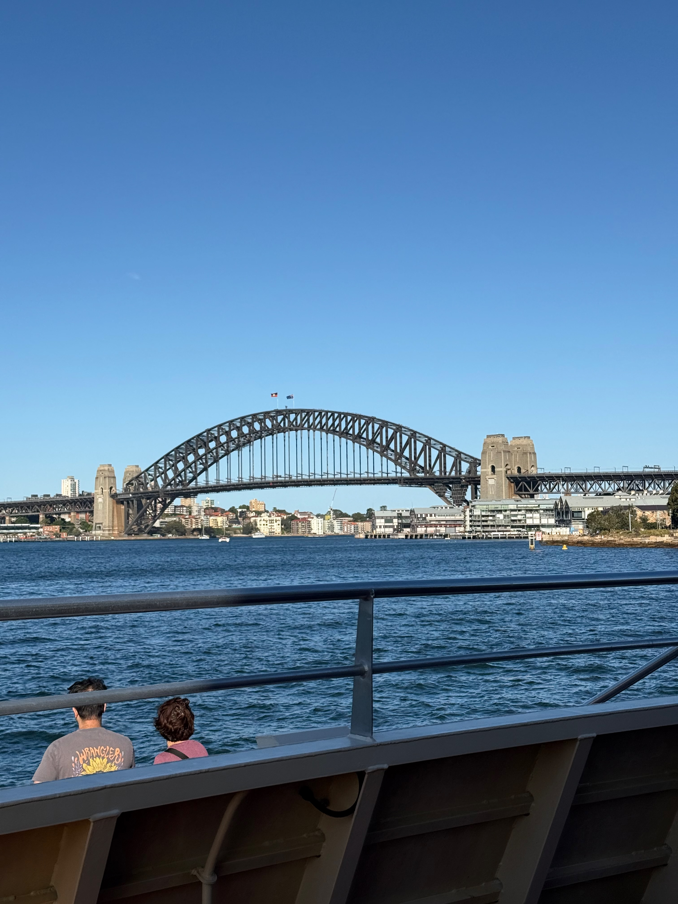

### Manly---Circular Quay

从 Circular Quay 坐船往返 Manly 是另一道风景线。一路视野开阔，会经过澳洲第一座灯塔、断崖、富人区，感受悉尼的人文历史。往返Manly 的船，我做过两次，一次是来看日落，另一次是去 Manly 的沙滩和吃冰淇淋。 Manly 的冰淇淋非常好吃，第一次买冰淇淋的我真的很狼狈。我自信的问店员说，“I wanna two balls”，小哥黑人问号脸问我"ball?"，然后他问我是不是"scoop"。在中国，大家都说要几个球，没想到老外论“勺”。

Manly 是悉尼著名的冲浪沙滩。看当地人冲浪真是一件有趣的事，看他们在一个个浪花中翻滚，甚至被巨浪打翻又慢慢浮起来，但仍不忘记向前，只为最后那一下踏浪而行。我喜欢他们的坚持，海浪一次又一次，他们也一次又一次；我佩服他们的勇气，人类在大海面前渺小的不值一提，但他们仍试图探索、追寻。我希望有一天我也能学会冲浪，然后加入他们。

如果有幸，日落后乘坐 Manly 到 Circular Quay 的船，就可以看到悉尼最美的夜景。当船离开码头，绕过出海口，船头调转方向，船上的每个人都不自觉地掏出手机，看着前方这座拥有百年历史的海港大桥越来越近。火力全开的汽轮机、不讲道理的海风、灯火辉煌的悉尼歌剧院以及身边来自世界各地的面孔，会给船上的每个人一种如梦似幻的感觉。悉尼真的太美了，美的不真实，美的让人陶醉。也许未来，无数次，我都会想起 26 岁那个夜晚踏浪前行感受世界的自己。

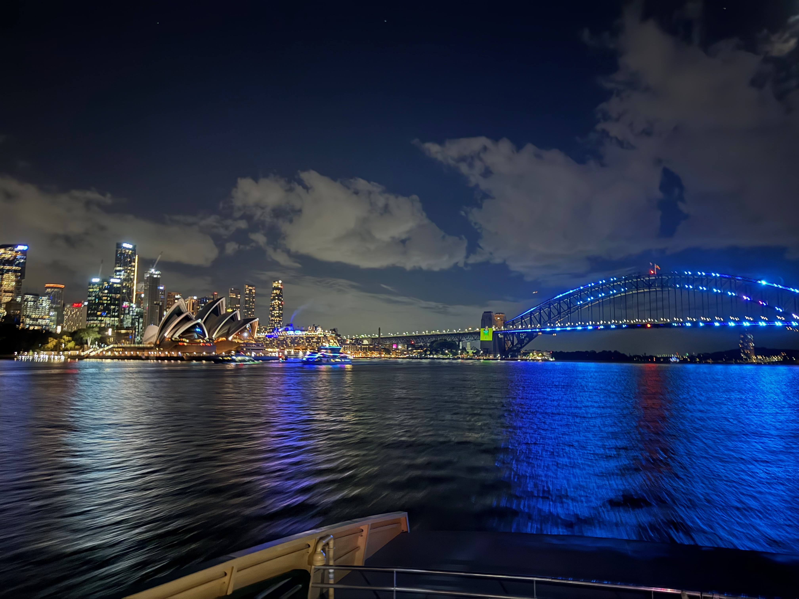

## City Walk

朋友和我说，澳洲的每个城市都有 Town Hall，也就是市政厅。一般来说，Town Hall 就是一座城市的市中心。面向 Circular Quay，左手边是商业街、右手边是圣母玛丽教堂、州立美术馆、州立图书馆。

### 悉尼大学(USYD)

悉尼大学离我住的地方很近，同时又是很多朋友、同学的母校，所以必须来一探究竟。

从维多利亚公园，径直走，就能看到悉尼大学的主楼——哈利波特楼。这座楼有百年的历史，也是悉尼大学最具标志性的建筑。在校园里，走走停停，拍照打卡，看到了很多中国人。果然，中国人对大学一直有一种执念或者滤镜。据说在澳洲，本地人会看不上读大学的人，因为即使没有大学文凭，依然可以找到好工作。让喜欢学术研究的人去读大学，让其他人早点去工作，好像也是一种教育方式。当然，最好的还是，每个人都能接受大学教育，并在毕业之后找到自身的使命和价值。

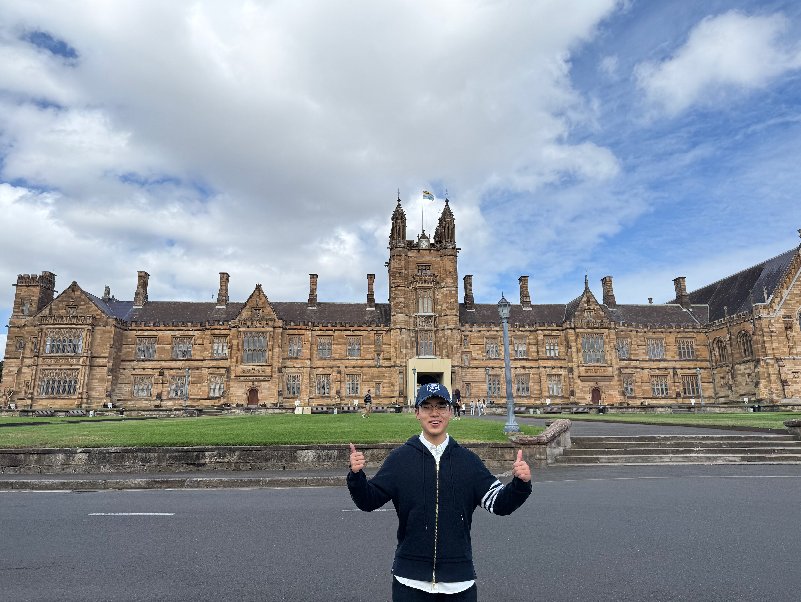

说回悉尼大学，这座学校给我印象最深的是主楼侧面的**Roll Of Honour**，这是为了纪念二战期间牺牲的悉尼大学师生。这些人，大多数应该都是普通人，但是学校还记得他们的奉献。这背后传递的其实是一种**贵族精神**，告诉后来者，荣誉、责任、勇气、奉献的重要性。

### 人文艺术

悉尼的人文艺术，氛围其实并不浓厚，但抱着一颗好奇、敬畏的心去欣赏，总能有些收获。

我们从海德公园逛起，看看悠闲的人们在公园遛狗、发呆、野餐。圣母玛丽是我去过最大的教堂了，和电影里一样，最前面是舞台，下面是一排一排的座椅，还赶上了当地人做弥撒。州立美术馆里都是近现代的画，试图感受澳洲短暂的历史。州立图书馆，分成新馆、旧馆两部分，旧馆很有英国王室的艺术气息，而新馆的设施资源是那么的丰富，虽然国内的图书馆已经越建越漂亮了，例如浙大主图书馆，但人均资源占有率仍然是无法比较的。

### 商业街

悉尼的商业街集中在乔治大街上，只允许有轨电车和行人通行。我在乔治大街上漫步，吃过一家很好吃的越南米粉，逛过一家球衣专卖店，对比了 UGG 、北面、始祖鸟在澳洲和国内的价格，去泡泡玛特看国内断货已久的星星人。但在中国一线城市生活过之后，再回头看这些店铺，无论是门面还是产品的丰富度，都显得相对普通。这种对比反而让人更直观地感受到，中国在国际化程度上的完成度，确实已经走得很远，也很扎实。

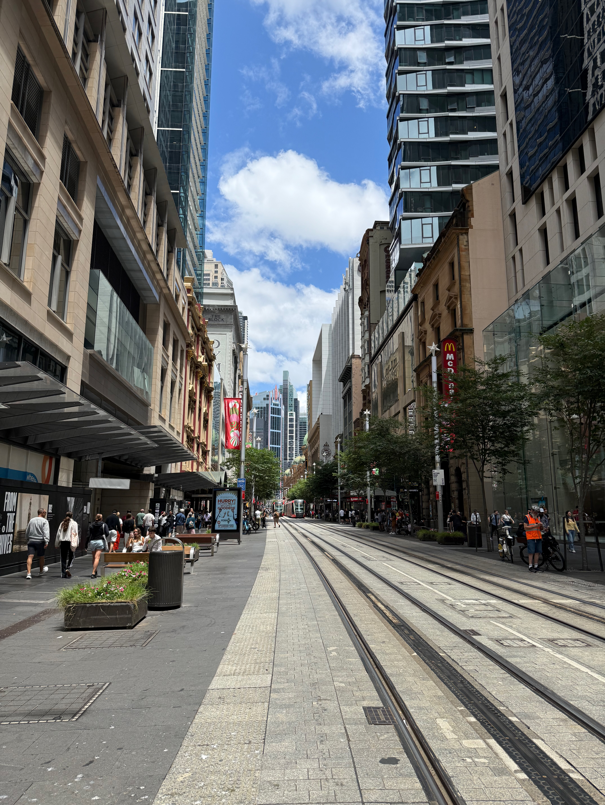

每到一个城市，我都会去看当地的 Apple Store，在 Apple Sydney，店员小哥夸我的 outfit 看起来非常棒。同时，我体验到了大陆地区一直没上线的 Apple Intelligence。店员小哥热情地给我介绍了 3 个使用场景，包括图片的 cleanup 、邮件智能回复、生成 emoji，三个功能本身并没有多么特别，但苹果的UI 特效和丝滑的体验还是让我印象深刻。我很期待Apple Intelligence在未来能将大模型更好地结合到软件系统中，给用户带来更强的工具。

QVB，悉尼地标建筑，百年商场。商场的布置、装饰都极其漂亮，两个钟彰显了贵气、历史和荣誉。人们在这里喝着咖啡、吃着甜品、满怀笑容地迎接新年。商场的中庭是一颗有三四层楼那么高的一颗巨型圣诞树，二楼紧挨着圣诞树的是一架公共钢琴。这架钢琴是*Concerts for All*捐赠的，用于丰富QVB Community. 我看到陆续有各个年龄段的人，包括：小朋友、青年人、中年人、老年人，坐在这里演奏自己拿手的曲目，他们积极、乐观、礼貌、自信，每个人都在试图通过音乐讲述自己的故事 亦或是 传递爱与力量。那一刻，整个世界吵吵闹闹，但我的内心却异常安静，这也许就是环境和音乐的力量。

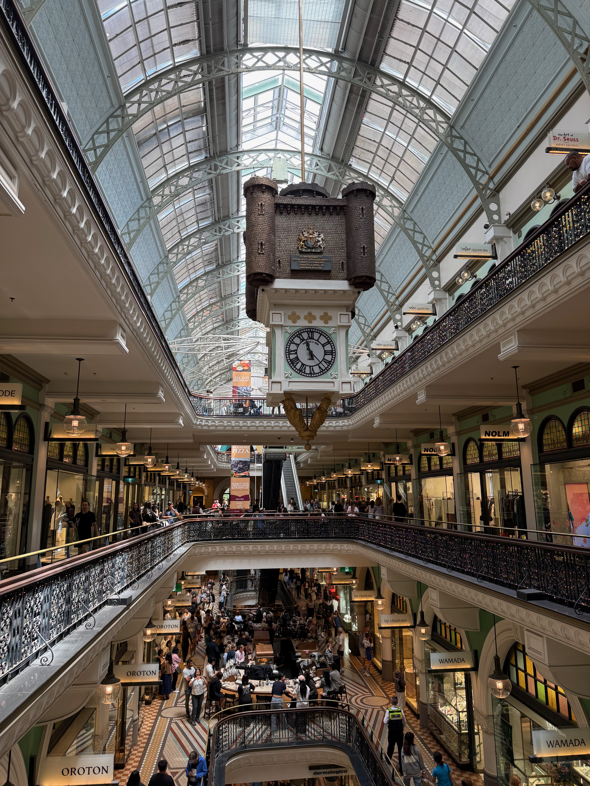

离开悉尼的前一天，也是2025 年的最后一天，我又去了 Town Hall。在 Town Hall 门口看到了英姿飒爽的骑警，各种街头表演的“艺术家”，又去 QVB 听了很久的钢琴。我试图深刻感受这座城市的色调和温度，感受另一种文化，感受自己复杂的思绪。

### The Star

The Star是一家坐落在 Darling Harbour 附近的一家赌场。整个赌场像一个大型商业综合体，购物、吃饭的地方应有尽有。赌场的门在二楼，需要查验证件，年龄符合要求，才被允许进入。朋友总是把“赌”字挂在嘴边，我说，这叫 **entertainment**。这样我们的行为就名正言顺了。我们是晚上9 点半到的，在排队的时候，身后的两个白人小哥，目光注视着我，笑着说“black red black red...”，我不懂他们的意思，但仍以微笑回应。进去之后，我才知道赌场里的老虎机，有一个环节就是猜黑红。

赌场里有很多玩法，老虎机、投骰子、百家乐、弹珠、牌九等等，这些游戏几乎不看操作，全凭运气，当然赌场要赚钱的。最吸引我的，当属百家乐，“小老虎、大老虎、庄家、闲家”，这些词熟悉又神秘，每个玩家的表情和动作都值得观察和琢磨。赌场里最多的就是华人，而且是 45 岁以上的华人，也许对于他们来说，拿出几百或几千来这里 happy 一下，是他们的日常。原来另一片土地，中老年人的生活可以这么丰富多彩。

我们只玩了老虎机，毫无疑问，血本无亏，期间也没有赚过多大的赔率。我喜欢赌场，除了分泌更多的多巴胺，还能见识人的另一面。

## 海

澳洲蓝绝对是悉尼最浓墨重彩的一笔

### Bondi海滩

Bondi 是悉尼最盛名的海滩，全世界的人会来这里冲浪、晒太阳。海滩旁边的无边泳池，几乎是悉尼**必打卡景点**。虽然说就在一个月前，这里还发生了枪击事件，死了 27 个人。但海滩上依然人满为患。我们换好泳装，踩上软绵绵的沙子，就下水了。在国内，包括三亚，我从没体验过这么细颗粒的沙滩。没有其他大陆的阻挡，太平洋和印度洋的海水会直接冲击大洋洲，所以悉尼的海浪更急、更大。

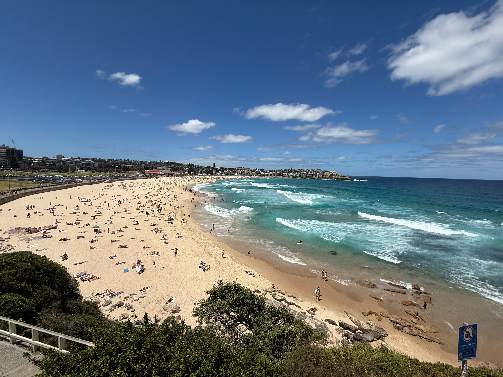

在海里游泳，不自知地离岸边越来越远，几个浪打过来，让我来不及反应，几乎要把我拍晕。幸好，危急时刻足够冷静，掉头足够快、肺活量足够大。当时的脑袋里，只有权游中那句经典的台词，“面对死亡之神，我们要说什么？” “Not today” 。恐惧远比真正的危机更可怕，可怕的多。 2025 年，逐渐意识到自己并非无所畏惧，意识到自己所有的行为都或多或少地受到恐惧的影响而无法活出真正的自我。在死亡的边缘徘徊，让我更加珍惜生命，同时也让我变得更加勇敢，不怕失去。

在 Bondi 的更衣室里，一个人高马大的白人突然指着一瓶清扬洗发水问我，是不是我的。

我说，是的。

他接着问我从哪来。

我说，中国杭州，上海附近。

我反问他。

他说，Houston, Texas。

然后他提到了姚明。

我顺口回了一个布什。

他愣了一下，随即笑了笑。

Bondi 的另一个特点是，**衣服粘人**。俊男靓女喜欢穿最少的衣服，躺在沙滩上晒太阳，顺带展示自己优美的线条。不得不感慨，老外的身材真好啊！中国人什么时候能不再比 “谁更有钱”、“谁更有权”？来比比，谁身材好、谁做饭好吃、谁能够活出自我。躺在 Bondi 无忧无虑地享受大自然的馈赠，真是一种人生享受！

在Bondi还解锁了多个人生新体验。第一次被水母蛰、完美的沙滩照、与海浪斗智斗勇。

### Bondi---Bronte徒步

从 Bondi 海滩走上来，便是著名的 Bondi---Cogee徒步路线。这条路线依山傍海，风景真是绝美。

游完泳去徒步，朋友体力不支，我们只走了 Bondi---Bronte 这一段。一路走走停停，时不时发呆，时不时聊天，我们聊澳洲当地生活、聊他第一次去纽约、聊我们的成长轨迹、聊祖国的发展。

我：“你很早就有出国留学的意识，并真正地走出来，是需要足够的见识和勇气的。”

朋友：”也没有啦。本科毕业之前，家里都安排好了。那会看着你们日出夜归准备考研，我还很焦虑呢，总觉得自己很轻松地就来了悉尼大学。“

我：”过程不重要，结果才重要。你避开了内卷，剩余的时间反倒可以花在更重要、更有意义的事情上面。”

然后我们就不自觉地聊起大学做过最疯狂的事。

海浪不停地拍在礁石上，溅起很大的白色浪花。近处的海水偏绿，远一点慢慢变成蓝色。我们就坐在石头上吹海风，什么也没做，但烦恼好像自然就没了。

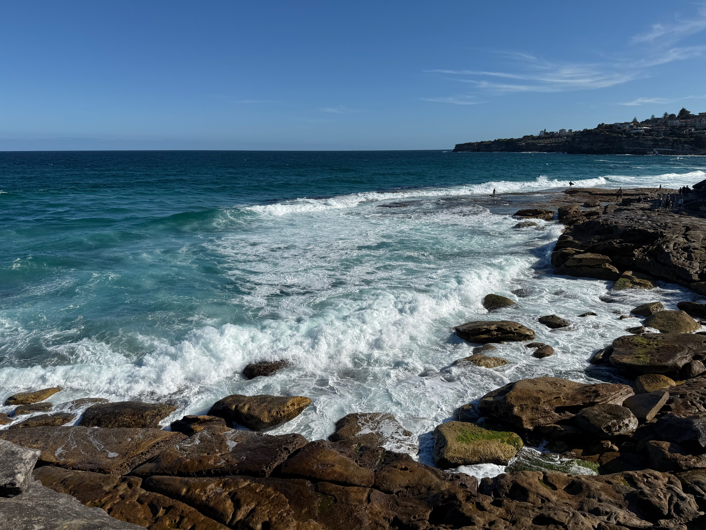

后来再想到澳洲的海，脑子里最先浮现的，就是这一幕。

### Wastons Bay

Wastons Bay位于悉尼港的出海口，是悉尼著名海湾。一侧可以远眺整个悉尼，另一侧是广阔无垠的太平洋。最先经过的是面朝太平洋的The Gap悬崖，往前走是停满小船的海湾，一边波涛汹涌，另一边风平浪静，形成了鲜明的对比。

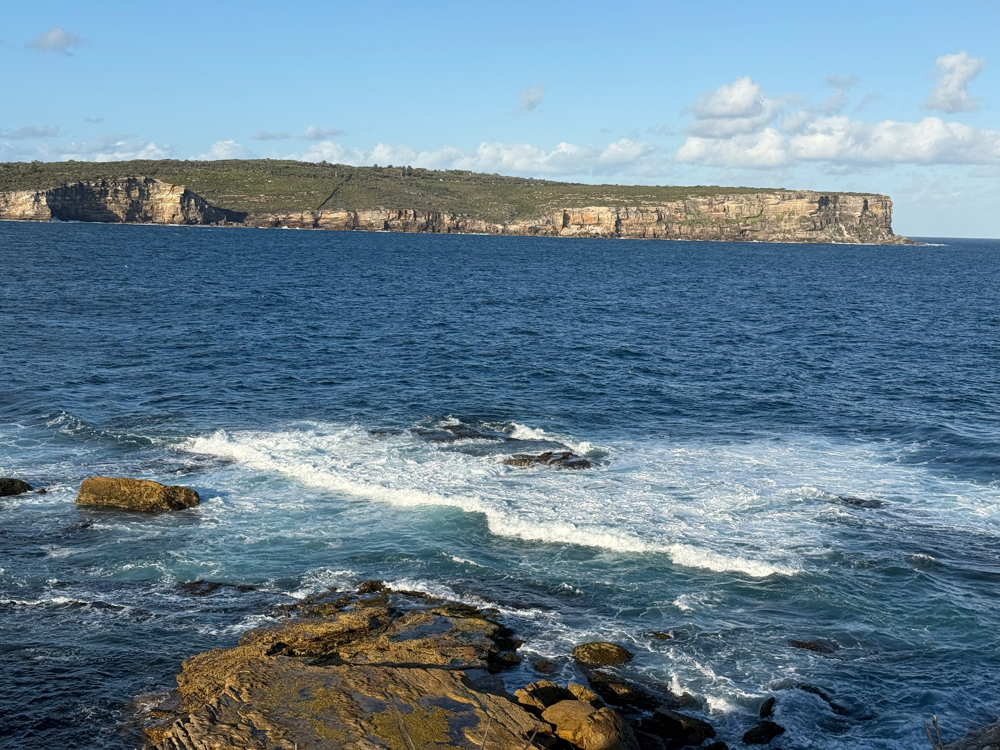

路上我们路过了一片富人区，我在其中一个豪华别墅门口拍了一张照片。不到一分钟，里面的管家就出来质问我并要求我把照片删除。 Amazing~ 他们在门口装了摄像头，看得出来非常注重隐私，哪怕是外立面也不能拍。再往前走，路过了悉尼著名裸体海滩Lady Bay Beach，从上面俯瞰下去，发现是一帮大爷。大爷看到上面有人往下看，害羞地用手挡了挡下面。

我们的最后一站是守着悉尼出海口的 Hornby 灯塔，这是澳洲的第一座灯塔。抬头，赶上了土澳晚上 8 点半的日落，悉尼塔被染成了金黄色，海上的游轮正在缓缓而行。周围的人拿出野餐布，不紧不慢地坐下来，弹吉他、聊天说笑。我们就坐在灯塔下的山坡上看了一次完整的日落，安安静静地享受。那会我一直在想，前天我还在上班，今天就可以跨越赤道来南半球看海，一切都那么不真实。

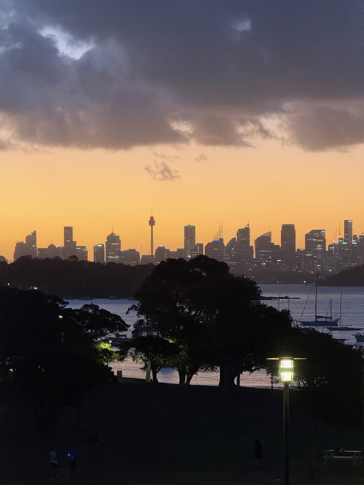

### Kiama

Kiama是悉尼附近的一个小镇，从市区出发要坐 2 个小时的火车。我的行程很紧，本不打算来到这里，但朋友很推荐这条**追萤火虫+看海**的徒步路线。

走出 Kiama 火车站，看到各种风格的小房子。每个小房子的涂装都很有特点，以高饱和度颜色为主，搭配澳洲天空蓝随手一拍就是建筑艺术大片。沿着海边走，一路看到灯塔和巨型的松树以及绝美的海，走到尽头是 BlowHole景点。BlowHole是石礁被大海侵蚀后形成的一个洞。每当海浪变大，海水就会冲上洞口，形成美丽的浪花和彩虹。人们都蹲守在 BlowHole 等待浪花冲上来，体验虽然凶猛但足够安全的反差感。迎着海风，我们在礁石上跳来跳去，前后左右都是一望无尽的大海，仿佛只身来到了世界尽头。

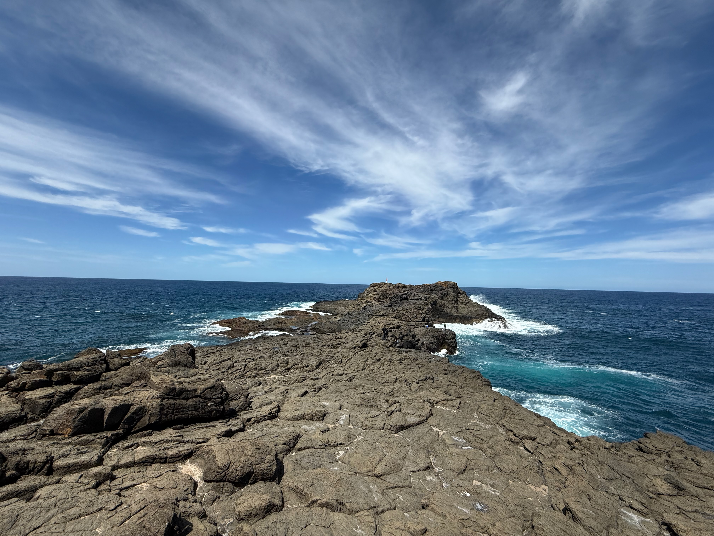

期间，我帮了两伙人拍照，其中一个是来自中国的小姐姐。简单聊了几句，她也是自己一个人来旅行，我引导她拍了好几张照片。临走前，我说你 check 下，不满意我可以继续拍。她告诉我，我拍的照片肯定很好看，不用看了。不管她是不是高情商，我的心里都暖呼呼的，被信任的感觉真好。我的朋友说，可能是我当天的 outfit 很不错，所以更容易获得信任。

澳洲的海边必然离不开炸鱼薯条。我们去了一家紧邻着海边的店，我点了一份炸鱼和一瓶啤酒。炸鱼很新鲜、很嫩，配上一瓶苦涩的冰啤酒，真是无比地惬意。悠闲不过如此了吧，以后就应该过这样的生活！从餐厅门口出来，有一只鹈鹕。它的嘴巴好长、好尖，我坐在外面的椅子上静静的观察它。于是，它便朝我走来，越来越近，我开始有意识的向后退，恐惧是本能。不过，澳洲的小动物都很温和，但也不怕人，真是有一种人与自然和谐共处的美好。

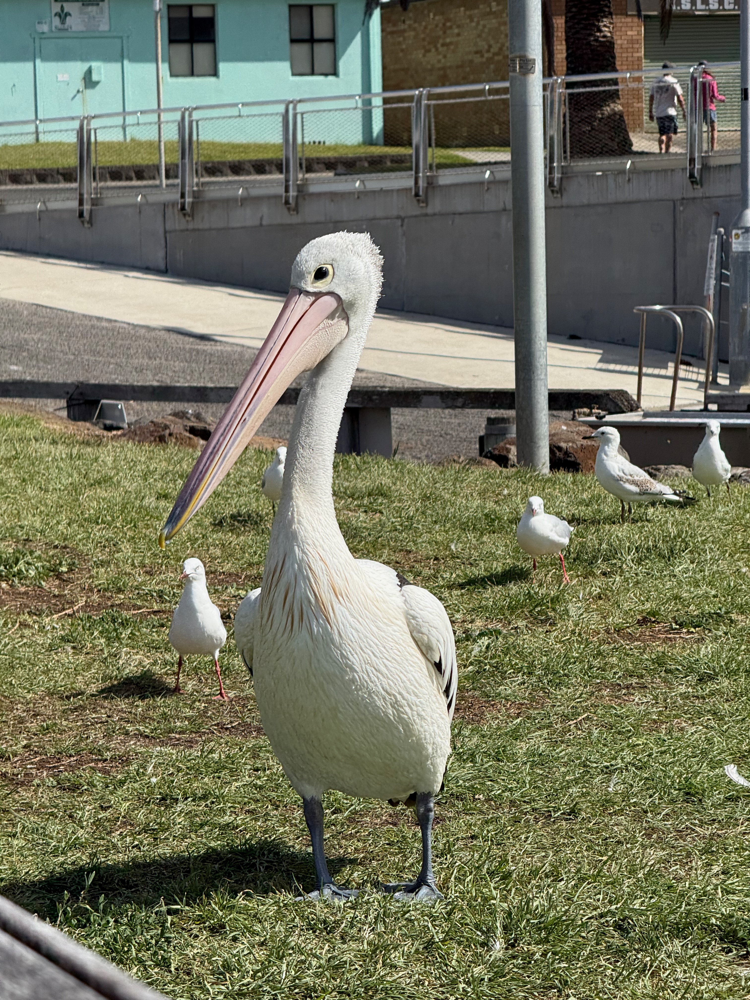

## 跨年夜

相比春节，元旦跨年更像是我们年轻人过的节日。去年在冰雪世界哈尔滨跨年，今年在悉尼跨年，也是我第一次在国外跨年。2026New Year Eve，悉尼官方围绕海港大桥举办了一系列庆祝活动。最让人期待的非 0 点时刻的烟花秀莫属，长达 12 分钟。 达令港、海港大桥、歌剧院这个沿线有多个燃放点，热闹非凡。

最好的烟花观看点位，几乎都集中在悉尼歌剧院附近。从早上开始，就陆续有人带着装备“抢占地盘”。Circular Quay 周围的关键交通枢纽，都停止使用，马路上直接摆起了大巴。新年的气氛这不就来了么。

我们没有充足的时间，最后在晚上 11 点赶到了达令港附近的一个小码头。小码头依然是人头攒动，草坪上有烤披萨、卖啤酒的小车，还有一个 DJ 台。在烟花秀开始之前，大家围着 DJ 台跟着音乐蹦迪，很喜欢在异国他乡与不同的面孔交流，体验不同文化之间的融合。

期间，一个法国人用标准的法语跟我讲“Boujour”，我面带微笑回了一句“Bonjour”。然后他开始很热情地和我讲法语，我用英语回了一句“I  can't understand. Are you from France? ”，他似乎没有听懂我的英语。法国人的英语好差呀。

当零点钟声响起，海港大桥顿时被灿烂的烟火装饰，悉尼歌剧院被五颜六色的烟花点亮，那是一种无比浪漫的美。我在国内见过更盛大的烟花，但是悉尼带点英伦的浪漫还是很特别。烟花绽放的那一刻，手机上的时间变成了 2026 ，新的一年开始了，而我悄悄地许下了心愿。我真的无比期待 2026 年。

# 墨尔本MEL

这次行程只安排了两个城市，悉尼和墨尔本。在我的潜意识中，墨尔本是最能代表澳大利亚的城市。再加上，墨尔本的咖啡文化和人文艺术早就闻名全球，来世界上最宜居的地方看看吧！

## 初见

新年第一天，早上 5 点半，赶上了悉尼的雨，一个人拉着行李箱跌跌撞撞地走进了 Central 火车站，坐上 T8 机场线赶7 点半飞往墨尔本的飞机。比较惊讶的是，澳洲国内飞行，甚至不需要查看证件。值机的方式也略有不同，需要打开对应航空公司的官网，输入订单号进行值机、办理托运、打印登机牌，而国内往往只需要通过携程类软件就可以搞定了。

我乘坐的这班飞机是QANTAS航空公司的，整体体验非常不错。登机按照分组依次进行，十分有序；同样的空客 320，比国内少很多广告，而且更加整洁、干净、甚至座位更加宽敞；飞机上的吃的也很丰富，我主动点了一份早餐，热情的空姐竟然给了我两份，酸奶、果干、曲奇饼，都很好吃。悉尼飞墨尔本，只需要1.5h，从飞机俯瞰澳洲的地貌，还是十分震撼，能感受到那种未经开垦的原始和新鲜。

落地墨尔本，看到与悉尼完全不同的地貌和植被。悉尼是繁花的海港都市，墨尔本是看似荒凉实则精致的“大农村”。墨尔本机场的圣诞装饰非常漂亮，一进入航站楼，浓浓的咖啡香扑面而来，这样的环境和氛围点燃了我的兴奋。

取完行李，走出航站楼，要乘坐 Skybus 前往市中心。Skybus的工作人员看到我站在购票机器面前矗立了许久，很热情地问我，Are you ok? 我微笑着说，I am good. 当时我正在看小红书的攻略。随后，我等来了前往南十字星火车站的巴士，这是一个双层巴士，我坐在上层的第一排，有着非常开阔的视野。一路，我们离市区越来越近，看到了摩天轮，以及墨尔本的高楼。的确有疯狂动物城的感觉。

墨尔本给我的第一感觉是更加热情，浓浓的生活气息让我更加放松。我很喜欢墨尔本。

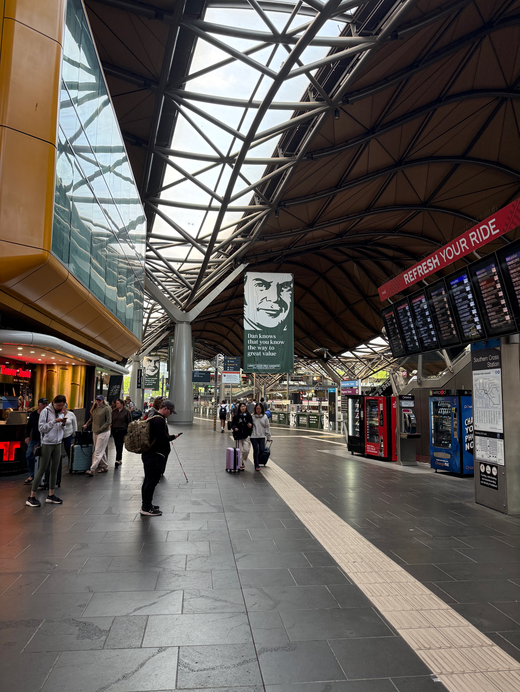

## City Walk

我在墨尔本只停留一天半，其中一天要去大洋路，City Walk 的时间就只有半天了。墨尔本这座城市，没有几个月的时间，是没法切身体会那么多的世界美食、涂鸦、街头艺术那种文化氛围的。所以，我的决定是，买一杯咖啡，随便走走，慢一点刚刚好。

我在墨尔本住在旗杆花园附近，这里非常方便，属于墨尔本电车免费区。在酒店放完行李，我直奔一家 Google map 评分 4.5+的咖啡厅，买一杯经典的Flat White和可颂。咖啡的品质非常非常好，而且比国内要更便宜。我是咖啡不耐受的体质，喝完咖啡后的两三个小时，心跳加速明显，也许是这里的咖啡太浓了。

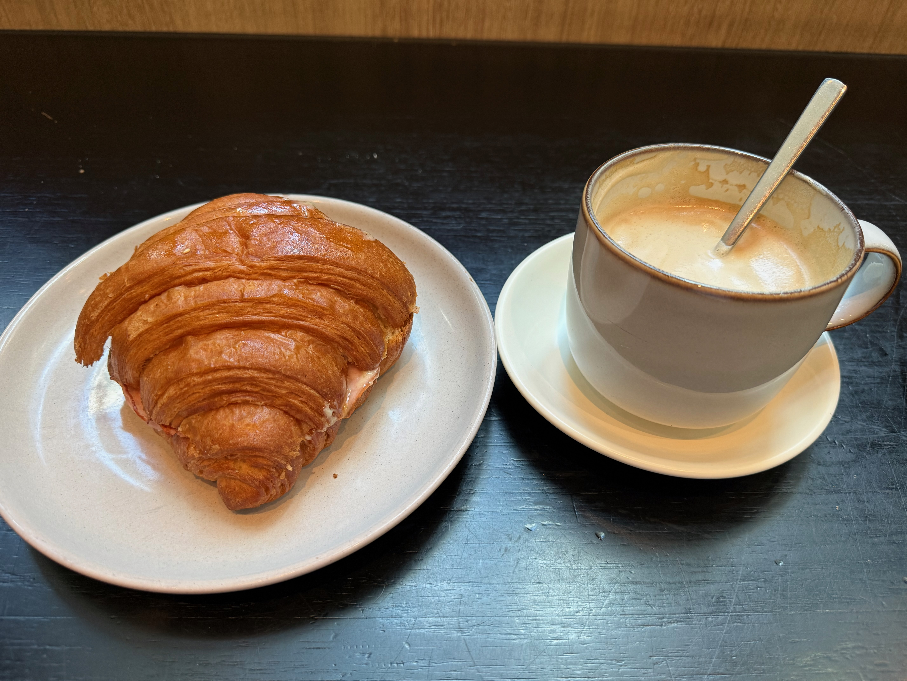

我的路线大致是：Central->State Library->Carlton Gardens->Melbourne Museum->Melbourne University->Flinders Train Station->Hoiser Lane->Yarra River->Skydeck。全程几乎都是步行。我最喜欢的是，买一杯咖啡，穿梭在电车横行的墨尔本中心，赏涂鸦艺术，看身边人的悠闲和无拘无束。这就是墨尔本的调调。先从 Central 开始吧。

### Central->State Library

Central 没有中国城市的市中心宏大，但足够吸引人。贴满星之卡比广告的电车叮叮叮地穿越人群，一眼望去都是世界级的咖啡厅和餐厅。Central 的附近就是维多利亚州的州立图书馆，当天是新年第一天，图书馆没营业。在图书馆的门口，矗立着骑士雕像，草坪上的鸽子密密麻麻，而人们在台阶上坐着说笑聊天。不羡鸳鸯不羡仙，羡慕澳洲生活每一天。

### Carlton Gardens->Melbourne Museum

Carlton Gardens是一个小公园，里面有非常漂亮的自然景观。一颗颗很粗大的树，坐在草坪上野餐的人，花园中心的喷泉，喷泉后面的皇家展览馆，所有的一切构成了这个美丽的花园。真的非常非常美。

Carlton Gardens 的后身就是现代的墨尔本博物馆。里面展示了各种动物、海洋、植被的进化过程。最吸引我的是一个室内的大自然原生态展馆，里面的树有几十米高，溪水中有各种各样的鱼，很像是一个豪宅中的自然景观。

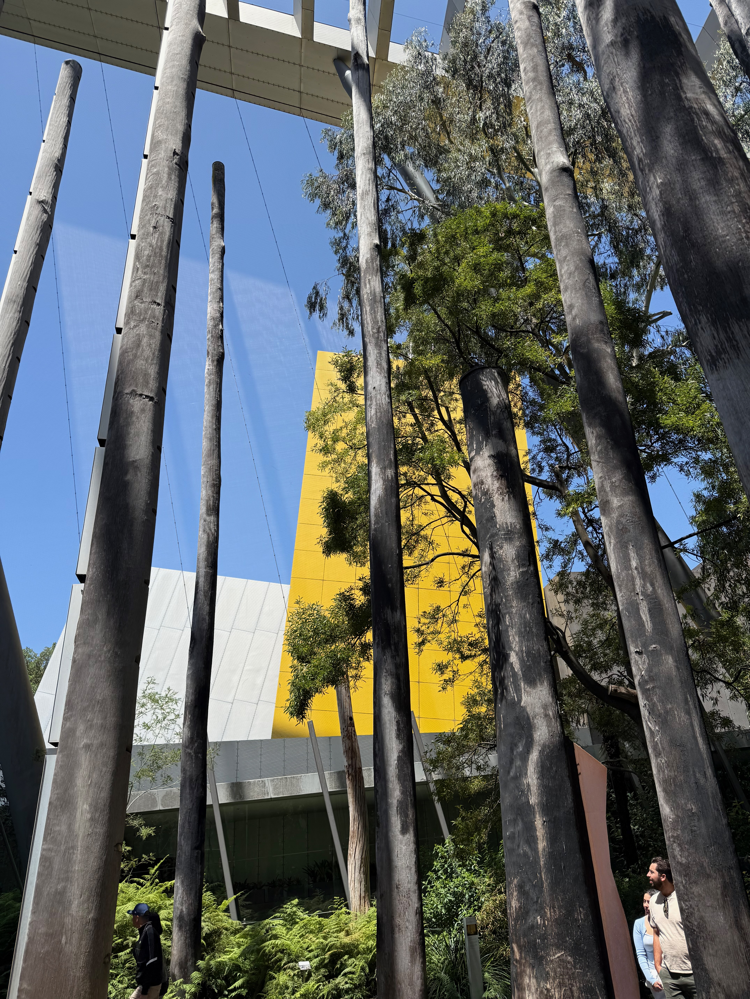

### Melbourne University

从墨尔本博物馆出来，走了一会就到了著名的墨尔本大学。莫大历史悠久、风景优美，校园里用广告牌的方式展示学校的 slogan 。我最喜欢的有这几句：

- Because we don't expect you to have a 10-year plan at 17.
- At the University of Melbourne the path is yours to create.
- You feel globally connected with people, places and professionals.

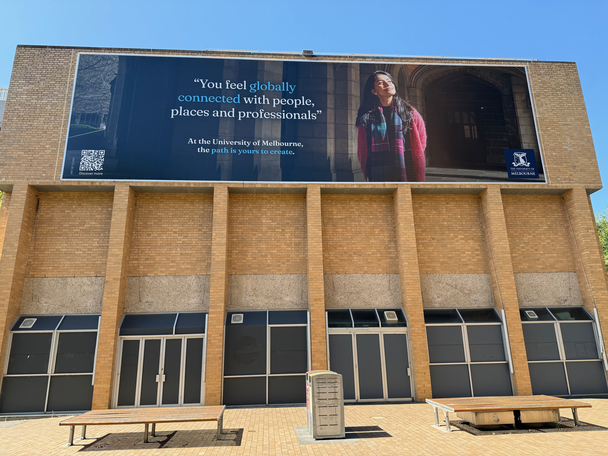

在莫大的机器人实验室门口，他们展示了用树干做的机械臂。第一次感受到，原来我们做的研究和学术离世界那么近。最后，我在莫大的钟楼下的躺椅上，闭上眼睛小憩 20 分钟，感受太阳的温暖和平静的美好。美丽的墨尔本大学，如果人生有机会在这里读书，真是“莫大”的幸运。

### Flinders Train Station->Hoiser Lane

Flinders Train 是墨尔本的标志性建筑之一。因为周杰伦之前来打卡过，所以更受到中国人的喜爱。我自己并没有特别的感受，就是一座比较古老的火车站。

Hoiser Lane 是墨尔本著名的涂鸦街。这里能感受到当地疯狂的涂鸦文化和不受拘束的氛围。涂鸦的主题有很多，有的是为女性发声，有的是致敬传奇（例如科比布莱恩特），有的是传递爱和力量。相比文字，涂鸦更直观，传递的信息量也更大，我的的确确感受到了涂鸦这种表达形式的魅力。涂鸦文化，也体现了墨尔本这座城市的包容和爱。

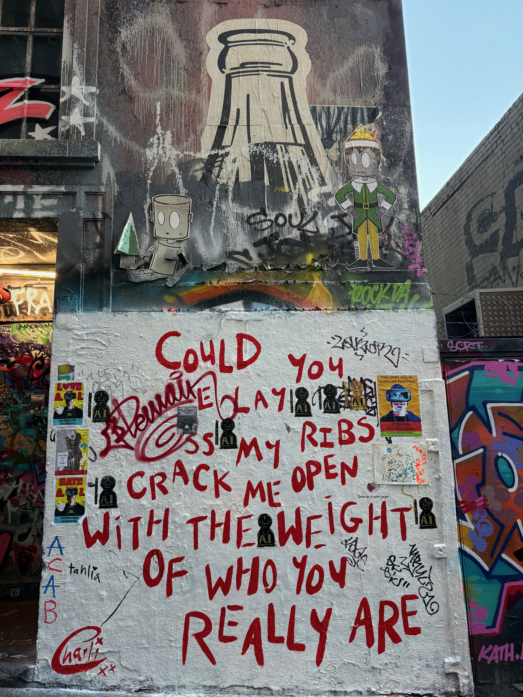

### Yarra River->Skydeck

雅拉河，澳洲土著称它为：永远流淌的河。有点墨尔本母亲河的味道。河的两岸有各种酒吧和街头卖艺者。其中，我看到一个小男孩勇敢地站到一个立式麦克风前面，唱了一首又一首的英文歌，台下的人们纷纷为他鼓掌。还有一个画家，只要 20 刀就能为你画一幅写真画，他的旁边摆满了他过往的作品。这种氛围，在快节奏的国内，几乎很难见到。

Skydeck 是墨尔本的观景台，可以看南半球的顶级内透。当天有超多的人，我排队 1 个小时才进去，到楼上已经晚上 9 点 20 了。观景台人超级超级多，整体体验不好。但是可以俯瞰整个墨尔本，近处是象征 CBD 的高楼，远处是普通人就住得起的 house 。一望无际的灯火，非常壮观。

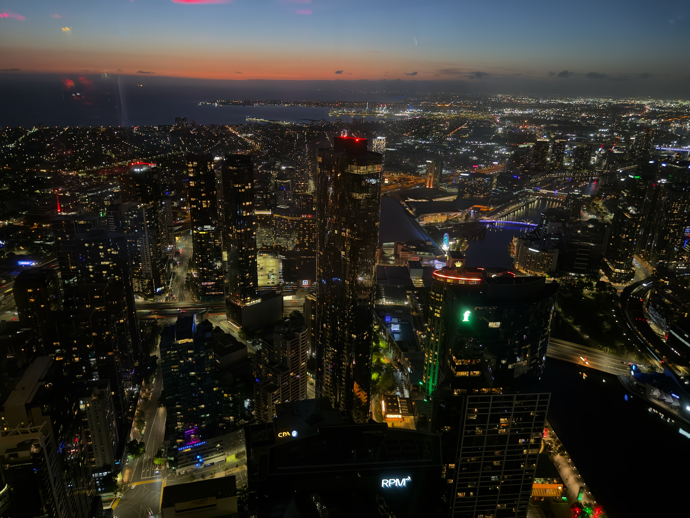

### 最后

如果时间充足，我想在墨尔本旅居一段时间，仔细感受这座城市独特的气息。很羡慕澳大利亚有悉尼和墨尔本这两座风格截然不同的世界级城市。悉尼的美用眼睛看就可以，但墨尔本的美要用心感受才行。

## 大洋路

大洋路是为了纪念一站时的士兵由 3000 名工人修建的，全长270 公里，我只花了一天走完，很不建议这么匆忙。大洋路最主要的景点毫无疑问是十二使徒岩。中学时期的英语课本封面就是十二使徒岩，所以它也是刻在每一个中国人心中的那个澳大利亚。

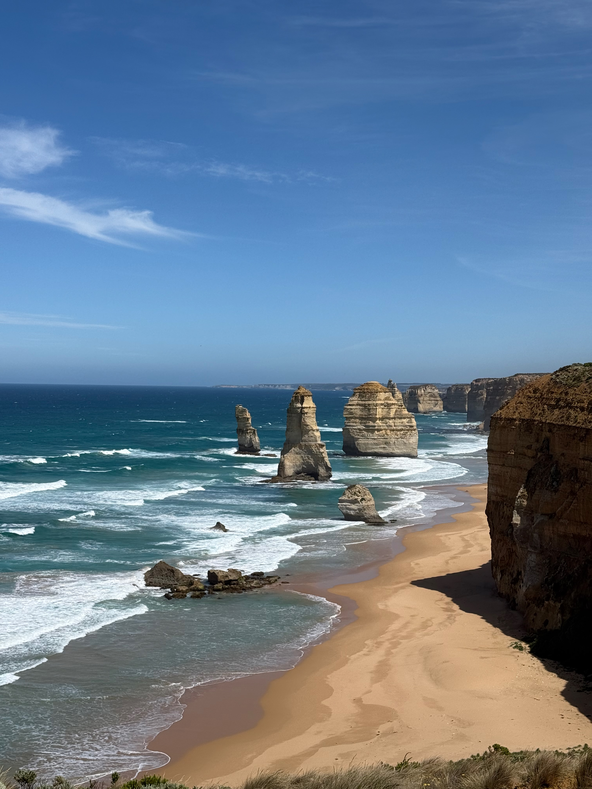

我是在飞猪上报了一日游的反向团，反向和正向最大的区别是，什么时候到十二使徒岩。反向游的第一站就是十二使徒岩，大概在中午 12 点，拍照不逆光。而正向游的最后一站才是十二使徒岩。我本来想报正向团，但是订的比较晚，只有反向的大巴团了。

上车之后，我们走内陆的高速，花费 3 小时抵达十二使徒岩。天气非常非常好，有幸见到了最壮观的一幕，十二使徒岩和大海的碰撞。期间，受邀和一位路人小姐姐合影留念，这也是美好回忆的一部分。

从十二使徒岩出发，我们正式踏上了大洋路，一路经过了洛克阿德大峡谷、阿波罗湾、大洋路路牌。蔚蓝的海洋一路相伴，我们还见到了呆呆的野生考拉，在阿波罗湾吃了一顿美味的炸鱼薯条。

下次，一定要选择自驾大洋路，感受路上的崎岖和壮阔的海景。

## 结语

从澳洲回来，除了领略到不同的生活方式，更强烈的感受到作为一个普通人本身就可以过得很幸福。在澳洲，普通人几乎不担心，食品安全、医保、养老等诸多“难题”，每个人都能平等地享有最基本、也是最重要的生活保障。所以，他们也就没有要凌驾于别人之上的心思。于是，人与人之间的关系变得平等；彼此独立、礼貌克制、不自卑、也不装逼，但又个性十足。每个人都可以充分地表达自我，活成自己想要的样子。

读万卷书、行万里路。希望自己能看更大的世界，接纳真实的自我，放下偏见，保持好奇！
