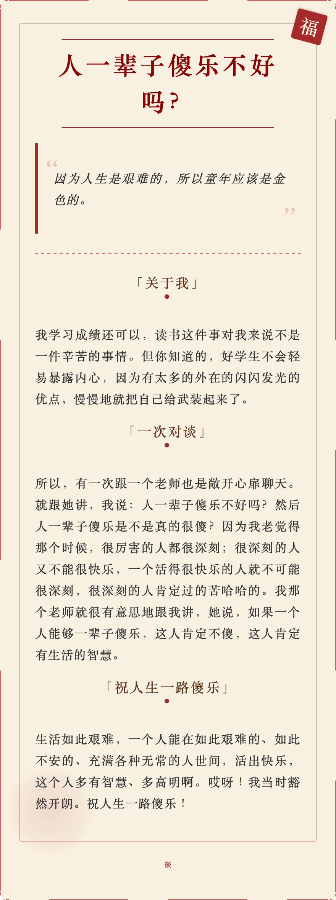

### 2025.4.4 

真正做事的人，都是偏积极和正能量的。做事情的人，大部分时候都是失败和挫折。顺风顺水总是少数时候，如果没有积极和正能量的内在品质支撑，根本就熬不到成功的时候。

满满负能量的人，要么就是loser，要么就根本没做过什么大不了的事情，也没有承担过大的责任。

### 2025.4.8

[Cursor的成功经验](https://mp.weixin.qq.com/s/bgqMfJ3vLo3XCQ7MdblFXA)

> 你必须重新构想工程师构建软件的界面.           ---Aman (Cursor创始人)

这个洞察成为了Cursor的核心理念——不仅仅是改进现有的代码编辑工具，而是彻底重新思考开发者与代码交互的方式。

> GitHub Copilot->CAD Copilot

> 从一开始就专注于用户体验是他们的关键优势.

> 自己就是产品的用户.

这表明，深入使用是做出好的产品的基础。

> 指令式编辑能力（Command-K）和代码库索引是cursor的两个核心功能.

Cursor的经验提供了宝贵的启示：专注于解决真正的用户痛点，勇于尝试和失败，构建有高天花板的产品，并保持对未来可能性的好奇心和开放态度。

### 2025.4.11

> 你遇到成千上万的人，没有一个人能真正融动你的心灵，直到遇见那么一个人，于是你的生活永远改变了。   ---电影《爱情与灵药》

### 2025.4.14

基于[MD2Card](https://md2card.com/en)生成，摘选自《岩中花述》S6E9，鲁豫对话陈果。

### 2025.4.17

> 文科袍服上织的是牛，理工袍服上绣的是马，穿上这身袍服，你我哪个不是Times New Roman

> 硕字怎么写？一个石字，一个页字。失业！

来源于大明王朝1566学术版

### 2025.4.22

> 面对世界的运动，我就像是个静止的石膏，在光的流转中退却，才发现欧洲之行不过是暂且逃避的岁月，世界并不会因为我的欣喜与沉醉发生变化。身边的同学已经纷纷迈向白领公务员的社会化光阴，而我却恐惧那些光线不过是有着开关的探照灯，而不是阳光。那些为喜欢而喜欢，为好奇而好奇，为自己而去奔跑的理想与心气，刹那间在同辈人中全部蒸发殆尽。原来大学生活只不过是保护我们心灵的最后一块围墙之瓦，而不是让我们寻找心灵的地方。   ---《人生的枷锁》豆瓣书评

### 2025.4.24

> I am not strange, I am just not normal.

### 2025.4.29

> 没有人能够真正解救你的孤独，除非你与自己的内心交谈。       ----苏岑

### 2025.5.2

> 每次有机会拥抱他，我都会紧紧拥抱，每次有机会告诉他我爱他，我都会说出来，没有什么未曾表达的，他知道的。                         ---[利物浦传奇门将阿利松](https://m.dongdianqiu.com/article/5066272.html)

### 2025.5.13

[电影里的纽约](https://www.douban.com/note/668627094/?_i=7119102-GWMUsZ)

> 自由女神像(Statue of Liberty)是美国的象征。Liberty是她的名字，它不同于freedom，那是一种极致的自由，是按照自己的意愿来选择生活方式的自由。

> 在物质世界里，”得道“与”入魔“的区别在于：是你发自内心坚定不移的热爱时尚专业，还是被物欲牵引着追寻被关注和尊重的眼神。如果热爱时尚，那么你的每个选择都是精心挑选的意义——你可以热爱CHANEL的女性独立气质，也可以热爱Prada的冷静简约、Hermes对于手工原料技艺坚持。而如果只想被关注和尊重，那么获得它的方式有很多种，不一定要通过名牌来装点，无需丰厚的物质基础，只要有基本的审美，自己的人生也可以是一件时尚艺术品。

### 2025.5.25

> “我讨厌人们说科技有多好，节约了多少时间，但省下来的时间却没人用，只是变成了更多的工作” 很有意思的观点，记得之前我在弗洛姆的《占有还是存在》里面看到过有点类似的观点，他说：“我们的社会充满了毫无幸福感的人，这已经是臭名昭著的事实了——人们孤独、焦虑、抑郁、具有依赖性和破坏性，千辛万苦省下来的时间被迫不及待地消磨掉。” 我最近思考了很多关于时间和闲暇的问题，我觉得很奇怪，为什么好像现代人的空闲时间变多了却又好像变少了，我们精打细算一分一秒的时间，却又把大把的时间浪费掉（这个浪费指的是kill time），我们渴望闲暇却又害怕闲暇，失去闲暇让我们疲倦找不到自我，过多的闲暇却又让我们发狂。 记得席瑞在辩论场上曾说，是闲暇让我们成为了我们，只有闲暇我在知道我所做的事情是因为我自己的意志。                ---《爱在黎明破晓前》b站评论区

> Baby, let's forget about the pride.          ---《爱在黎明破晓前》台词

### 2025.5.28

> 通过个人IP的方式，与用户进行沟通。因为时代变了，用户和企业沟通的渠道变了，企业的叙事方式也变了。 —《专访海尔-周云杰》

### 2025.5.29

> 人类需要靠寻找血脉来联系彼此，从而在内心深处感知：我们并不孤独。        ---《英雄 第一季》

### 2025.6.8

> 表扬要有场面，批评要有仪式，爱要大声说出来，责任状、军令状就得自己念。这就叫当众承诺。

> 表扬比批评威力更大。这就是荣誉锁定。

### 2025.6.9

> 一种对生活很有帮助的心态：接受现实，尽量不去后悔过去，努力改善现状。       
>
> ​																    ---《llya在多伦多大学的演讲》

> 我以前只会过一种生活，就是跟别人不一样。现在我知道了，大多数人都会选择的生活，才是值得的。
>
> ​																    ---《中国合伙人》

### 2025.6.11

> 寒山问：世间有人谤我、辱我、轻我、笑我、欺我、贱我，当如何处治乎？
>
> 拾得答道：你且忍他、让他、避他、耐他、由他、敬他、不要理他。再过几年，你且看他。

> People have a long-term important and curious advantage over AI: we are hard-wired to care about other people and what they think and do, and we don’t care very much about machines.
>
> ​																	---[Sam Altman](https://blog.samaltman.com/the-gentle-singularity)

> Many people will choose to live their lives in much the same way, but at least some people will probably decide to “plug in”.
>
> ​																	---Sam Altman

### 2025.6.23

周末在为女友的毕业疯狂庆祝，拍照、品尝美食、唱K、跳舞等等。虽然我曾经经历过这样的时刻，但我仍能感受到那是一种怎样的心境。欢乐、不舍、彷徨......

周一早上打开CC98，看到一篇标题为[《我确实已经失去了浙江大学》](https://www.cc98.org/topic/6222348/1)帖子，他把毕业比作“放一个长长的暑假”，讲出了毕业那一刻复杂的心情。

> 我想，这是因为，浙江大学归根到底是一种生活方式，而这种生活方式很大程度上意味着一种可能。它意味着，就算我只是躺在家里水着 98，我也知道，当我看到一门心动的好课的时候，我就可以试着在下学期把它加入课表。就算我只是刚刚度过了一个赶 ddl 的周末，我也知道，只要明天天气合适，那么我就可以跑到宝石山看上一场日出。我知道，食堂总会时不时的推出些新菜，而我总可以约上朋友们尝尝。我知道，若是学院又公布了什么对外交流的项目，就可以去争取一个出国交流或是交换几个月的机会。这样一个心照不宣的事实早就像呼吸一样难以被察觉：作为浙大学子，我们深度参与着浙大的一切，路边装修的新店面，楼下阿姨张贴的海报，公众号里的一则推文，对我们来说都是一种可能，一种参与，一种息息相关。不论我们以何种姿态行走于此，不论我们当下以何种程度参与各种校园生活，不论我们意识到还是没意识到。浙大的种种可能总是向我们敞开着。我们是行走在浙大的血肉里。

浙大的确是一种生活方式。它给了我们太多自由与包容，让我们看到了更大的世界，也给了我们更多的想象空间，让我们觉得自己的未来无限可能。在这样的氛围熏陶下，我们每个人都像打了鸡血般的，拼命地在人生这条路上飞驰。回头看，这样的生活虽不轻松，但却十分快乐。毕业后的我，有点想念那样的氛围，虽然自己仍然保持自律，但略显孤独。

### 2025.7.8

> 学会接受这个世界原本的面目，热爱它，归属于它并心存欢喜；学会只听从内心的声音，不屈从于外界的驱使，在自己的道路上摸索前进而不管它通向何方。                   ---[《浙大四年教会我的》](https://mp.weixin.qq.com/s/7DTgeUCUb8XTKjVzQdcgSQ)

### 2025.8.13

> 创建一家价值 100 万美元的公司和创建一家价值 1 亿美元的公司需要付出同样的努力，但采取的行动却不同。

### 2025.8.18

> 研究一切未知事物的基本方法：试探性地改变输入，观察输出。

### 2025.8.21

问问自己，除了眼前工资单和外部激励（画饼）外：

> 假如明天就失去这份工作，你的心力能否支撑你度过迷茫期？
>
> 
>
> 你的身体健康和生活习惯被工作侵蚀和让步了多少呢？
>
> 
>
> 你的核心竞争力和解决问题能力能否让你快速迁移到新领域？
>
> 
>
> 你的微信好友列表里有多少是有意义的人际关系，能提供关键机会？
>
> 
>
> 你的存款能否让你和家人在极端情况下安稳度过至少6～12个月？
>
> 
>
> 你也许能力很强，但你真的拥有求职或创业的能力和信息差吗？
>
> 
>
> 你的主动收入也许很高，但你的其他收入结构真的能够抗风险吗？
>
> 
>
> 除了薪水，是什么让你愿意主动投入和发挥出自己的天赋才干呢？

好的提问，

能帮助他人朝着积极的改变和选择迈出一大步。

这也是心理学和教练的受训经历里给到我的启发。

### 2025.9.8

一个人要成长，必须经过艰苦卓绝的长期努力。希望花五年时间，变成一个坚强成熟的灵魂，做一个哪怕泰山崩塌，也要把石头一块一块地从地里抠出来的人。

### 2025.10.11

纳瓦尔·拉威康特，他是Uber、Twitter 和 Notion的早期投资者。 他曾说过一句著名的话：“靠出租时间你是不会致富的。”

下面是他关于财富的十条教诲，真的是常读常新。

1、不要追逐金钱，要构建财富
财富是拥有可以在你睡觉时赚取收益的资产。金钱是我们转换时间和财富的方式。
大多数人试图通过追逐金钱来致富。 通过构建为你服务的系统来创造财富。

2、优先拥有股权
靠出租时间你是不会致富的。你必须拥有股权——即一家企业的一部分——才能获得财务自由。
用时间换金钱是一场输局。
真正的财富来自于拥有权。
不要当雇员，要做一个所有者。

3、建设或销售
学习销售。学习建设。如果你两者都能做到，你将所向无敌。
建设：创造价值的能力；
销售：传达价值的能力。
同时具备这两种能力是无敌的组合。

4、专注于长远目标
与那些有长远眼光的人一起玩长期游戏。
成功是随着时间不断积累的。
与那些考虑几十年而不仅仅是短期的人为伍。
你的人脉就是你的财富；有策略地建立它。

5、产品化你自己
将你的知识打包成可以反复销售的产品。
识别出你独特的才能组合。
将你的专业知识转化为一个可扩展的产品。
知识作为一种产品，是无限的杠杆。
6、能性是无限的
互联网大大拓宽了职业的可能空间。大多数人还没有意识到这一点。
财富创造的规则已经改变。
互联网让你可以接触到数十亿人。
发展你的个人品牌，并从中获利。

7、创建自动化产品
代码和媒体是无需许可的杠杆。它们是新富阶层背后的杠杆。你可以创建软件和媒体，在你睡觉时也能为你工作。
学习编程或创作内容。
这两种方式都能让你无限扩展影响力。

8、任何人都可以创造杠杆
如果你不会编程，就写书和博客，录制视频和播客。
你不需要技术背景也能创造可扩展的产品。
内容创作对每个人都是可及的。
你需要杠杆来建立财富。

9、你决定自己的价值
设定并执行一个有抱负的个人时薪。如果解决某个问题所省下的钱低于你的时薪，就忽略它。
我的时薪是5000美元/小时。任何低于这个价位的事，我都会委派或自动化处理。
你的时间是你最宝贵的资产；要保护它。

10、不断学习
学习微观经济学、博弈论、心理学、伦理学、数学和计算机。
财富创造需要多样的技能组合。
持续学习是必须的。
构建一个罕见的技能组合来创造独特价值。

### 2025.10.23

如果团队开始“以发布代替进步”，以“熬夜代替思考”，以“情绪亢奋代替有效协作”，那最终也不会有什么好结果。

### 2025.10.30

Some years you win, some years you build character. 

### 2025.10.31

建立个人边界的核心是表达真实的自我。         ---特里·科尔《掌控边界：如何真实地表达自己的需求...》

### 2025.11.24

我并非因为错失了感兴趣的专业而痛苦，而仅仅是因为我在一场竞争中落败了，我没有得到其他人的认可。

--- 《cc98 [outlier](https://www.cc98.org/topic/6352589/1)》

从大学教育的角度来说，独立思考、卓越的世界观和宏大的人生志向是毕业时比具体知识更宝贵的财富。

--- 《cc98 [outlier](https://www.cc98.org/topic/6352589/1)》评论区

韧性、自我思考、长期主义，这也许就是面对“生活毒打”之后一个人仍旧能够不断推动西西弗斯巨石的精神内核。

--- 《cc98 [outlier](https://www.cc98.org/topic/6352589/1)》评论区

文学就是文学，艺术就是艺术，不一定非要忧国忧民。             ---许子东《中国现当代文学的六个历史瞬间》

### 2025.11.26

生活推着我们所有的人，有些人放弃了，有些人在抗争。少数人学会了这门课程，取得了进步，他们欢迎生活来推动他们。          ---《富爸爸》

资产是能把钱放进我口袋里的东西。负债是把钱从我口袋里取走的东西。        ---《富爸爸》

学习，忘记，再学习。       ---《富爸爸》

### 2025.12.5

如果我们想要改造世界，唯一的方法是首先改造自己。       ---《西南联大求学日记》

### 2025.12.16

人会后悔的只有一件事，就是活得不够勇敢。    ---英国诗人泰德·休斯

### 2025.12.17

如果人不会死，也许我们也就不会有这么强烈地找寻真正喜欢的事业并从事终身的想法了。这就是死亡的美丽之处。
