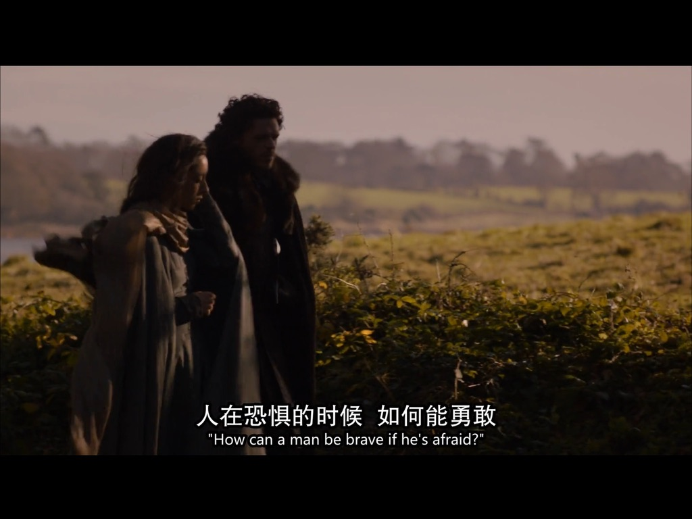
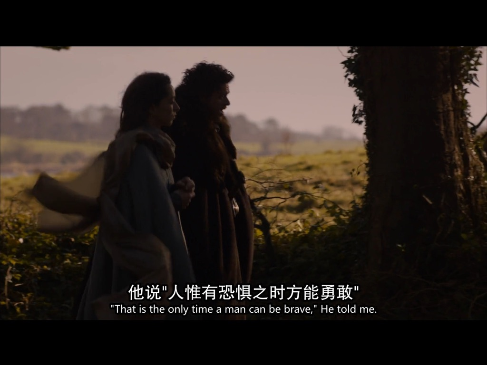

# 美剧

## 权力的游戏

> Winter is coming! 

从2025年 12 月开始看权游，除了精彩的剧情之外，我更佩服里面每个人物的勇气和自信。收录了一些我喜欢的片段和台词。

### 第一季

**小恶魔安慰雪诺**

小恶魔：“每个侏儒小子在他爸爸眼里都是一个bastard”  ”用bastard来武装你自己，这样就没人伤害得了你“

**二丫的狼咬乔弗里**

奈德：”你有没有受伤？没有就好。“ ”你们找到我的女儿为什么不通知我，而直接把她带到这里？“

**奈德安慰二丫**

二丫：“我讨厌国王、王后、烈狗、 Sansa”

奈德：“Sansa 要嫁给乔弗里的，她不能说不利于乔弗里的话。”

 二丫：“乔弗里不是好东西，Sansa为什么要嫁给他？”

奈德：“我们的族语是什么？Winter is coming. 你出生于盛夏，没见过冬天长什么样，冬天来临的时候我们都要保护好自己。Now, winter is coming. ”

**二丫在地堡偷听到父亲要被杀的对话**

二丫：“你们知道我是谁吗？我爸爸是国王首相、帝国之手，如果你们还拦着我，我爸爸会把你们的头砍下来挂在树上。”  “还不滚开！” 

**兰尼斯特追杀斯塔克家族**

二丫舞蹈老师：“当面对死亡之神时，你要说什么？” “not today.”

**小恶魔凭借信誉从艾林谷逃脱**

兰尼斯特，有债必还

**布兰坐阵临冬城**

“布兰，听不喜欢的人讲话，是一名国王要履行的义务。”

### 第二季

**罗柏回忆奈德**

“恐惧中如何才能勇敢？”

“只有在恐惧中才能勇敢。”

罗柏说，父亲奈德是世界上最出色的男人；珊莎说，父亲绝不会是叛徒；二丫说，父亲是因为忠诚而死。
奈德在权力的游戏里显得格格不入，看起来，他是第一个输掉游戏的人。可事实是，他的狼崽一个比一个勇敢、坚韧、自信。这是奈德永远的资产，是史塔克家族最亮眼的名片，也是对正义、忠诚美好品质最好的回馈。

**瑟后谈统治**

统治人民只有一种办法，让他们感到害怕。

## 越狱

### 第一季

**迈克尔和sara谈恐惧**
