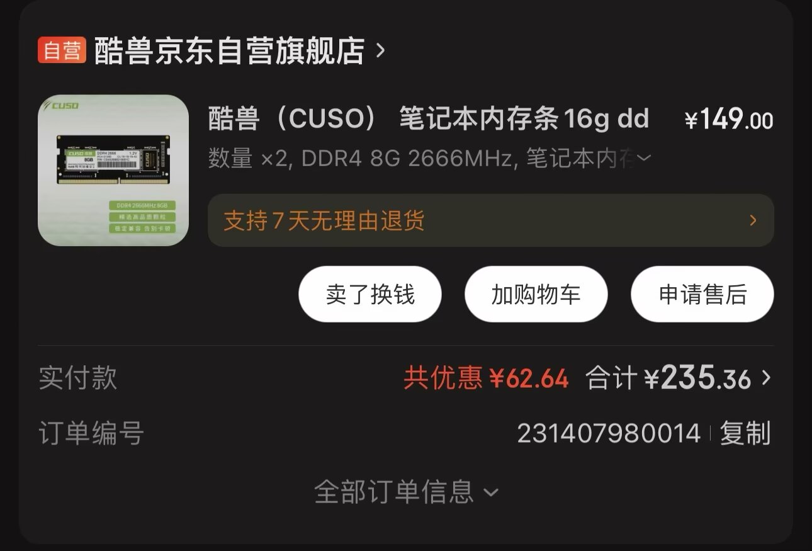
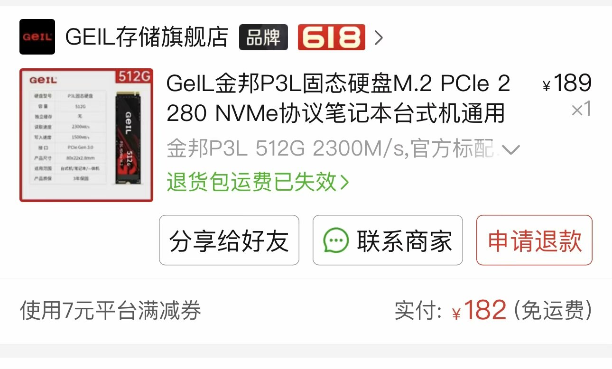
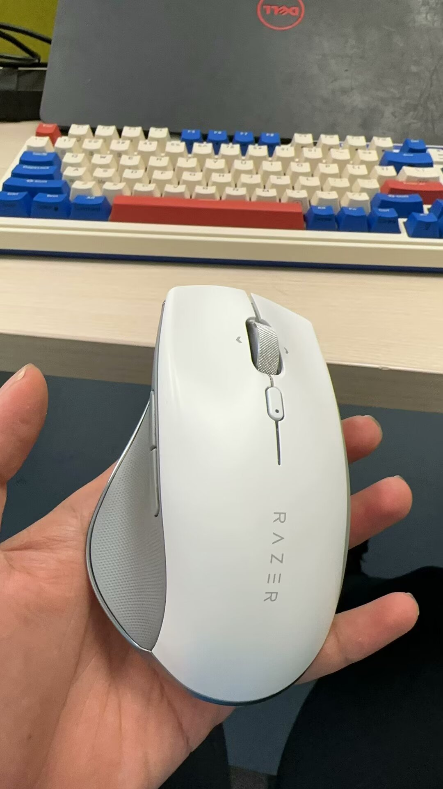

## 《3202年一台电脑可以用几年》

我的Windows电脑是在高考那年买的，距离现在已经过去了整整六年。（突然发现又要高考了）惊呼我的电脑竟然陪伴了我六年！并且依然用起来得心应手（for me）。下面谈谈六年间折腾电脑的一些小事主要是得花钱（bushi）

---- 
### 阶段一

本科四年，我的电脑主要用来PUBG、给他爱和做毕业设计，电脑正直壮年，一些简单的仿真分析也是可以轻松拿捏。除了偶尔吐槽显示效果太差之外，似乎对电脑也没什么兴趣和思考。

---- 
### 阶段二 

读研以来，对电脑的依赖程度和使用时间都逐渐增多，毕竟这可是我的实验设备！所以在研一上半年，我果断换掉了我的两个4g内存条。在京东下单了两条8g酷兽内存条，共计投入235元。体验明显提升，可以去洛圣都开虎鲸咯！

----  
### 阶段三

前段时间，我128G的固态装满了捂脸，果断皮多多购买了一个512GB的NvME固态换上，总投入182元，自此我觉得自己换了一台新电脑。
后来我又为我的小Dell配了一把机械键盘，选了一把Kzzi莱茵蓝治愈我的焦虑，然并卵总投入：435元。不久我又花了100大洋收了一个二手雷蛇Pro Click来换掉我皮多多20包邮的鼠标。

---- 
### 总结

至此我在这台电脑上的总投入为**952元**，其中外设上投入了535元。总体来说，我认为是值得的。内存条、固态硬盘这些硬件可以让我避免存储焦虑，可以把更多的时间花在更重要的事情上。而鼠标、键盘这些外设让我更愿意打开这台电脑去码字、去更轻松地浏览互联网世界。
**就是这些小小的改变积累起来，让这台电脑不像服役了六年之久的电脑，也让我拥有了更好的使用体验。我已经在期待下一个六年！**

所以回到题目，3202年一台电脑究竟可以用几年？

