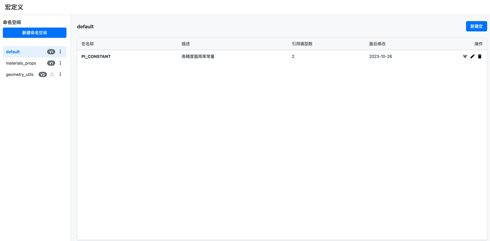
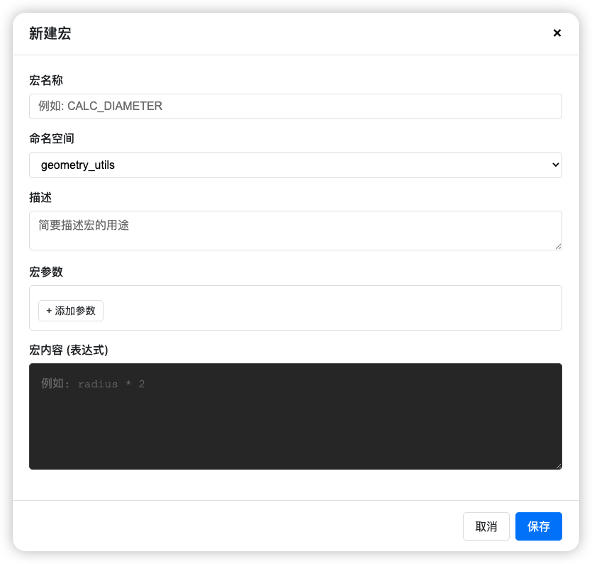

## 问题

做建模工具的时候，遇到一个很头疼的问题：

用户在编辑器里建模，经常要写很长的公式来处理枚举逻辑。比如根据不同的材质、尺寸、样式计算价格，公式可能有几十行。这种公式写一次不难，但是：

- **重复太多**：几十个模型都要写类似的逻辑
- **维护困难**：改一个逻辑要改几十个地方
- **容易出错**：复制粘贴时容易漏改参数

虽然之前做了批量功能来提效，但还是不够。从软件工程的角度看，这就是缺少"**封装**"和"**复用**"。


## 解决思路

借鉴编程语言里的"宏"概念，让用户可以：

1. **定义宏**：把常用的计算逻辑封装成宏，比如 `CALC_AREA(width, depth)`
2. **导入宏**：通过变量系（现有的一种与模型绑定的资源）导入到模型中
3. **使用宏**：在公式编辑器里直接调用，比如 `common_utils.CALC_AREA(#W, #D)`

这样一来，复杂逻辑只需要维护一份，所有模型都能复用。


## 在线体验

🔗 **原型地址**: [https://ai-prototype-macro.vercel.app/](https://ai-prototype-macro.vercel.app/)



可以试试：

1. 新建一个命名空间
2. 添加几个宏，配置参数和表达式
3. 修改宏内容，发布新版本
4. 查看版本历史和差异对比


## 原型介绍

### 1. 定义宏



创建宏时需要填写：

- **宏名称**：遵循变量命名规则
- **描述**：可选，方便其他人理解
- **参数**：支持多个参数，每个参数有名称和说明
- **宏内容**：具体的计算表达式

**设计考虑**：
- 宏名称不能重复，创建时要校验
- 编辑宏会影响所有引用它的模型，所以要慎重
- 删除宏时要有明确的提示："此操作会影响所有引用该宏的模型"

### 2. 使用方式

在编辑器的公式编辑器中，导入变量系后就能调用宏：

```
common_utils.CALC_AREA(#W, #D)
```

- 支持联想提示
- 输入不存在的宏会报错
- 鼠标悬停可以看到宏的定义

### 3. 技术实现

这是个纯前端原型：
- 原生 JavaScript，没用框架
- 用 localStorage 模拟数据存储
- 实现了基础的版本控制和 diff 算法


## 一点思考

做这个原型的过程中，最大的感受是：**B端产品的复杂度往往不在功能本身，而在影响面的控制**。

一个简单的"编辑宏"操作，背后可能影响成千上万个模型。如何让用户清楚地知道影响范围，如何提供安全的回退机制，这些才是设计的重点。

版本管理不是为了炫技，而是为了给用户"后悔"的机会。
