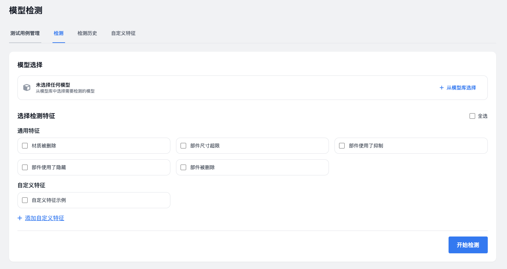
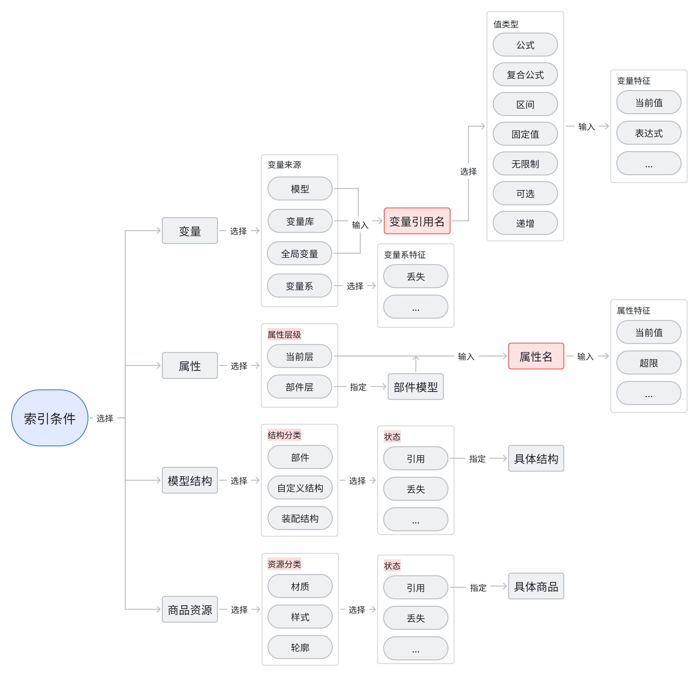
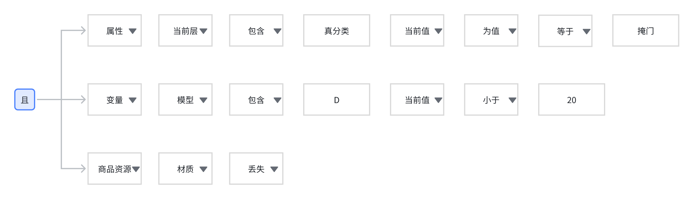
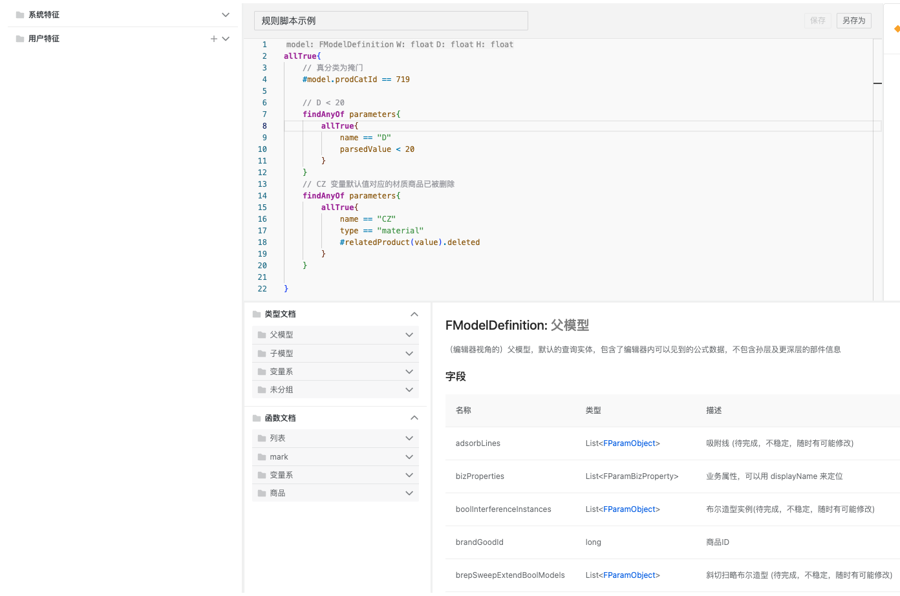

\---

title: "3D模型质量检测"

author: "KAI"

date: 2025-11-25

lastmod: 2026-09-27

tags: [

  "Verify",

  "3D"

]

categories: [

  "产品"

]

keywords: [

  "Web IDE",

  "DSL 设计"

]

\---

# 3D模型质量检测

## 问题

参数化模型的复杂性导致建模过程容易出错。一旦错误在发布后被发现，轻则返工，重则造成资损。

当前的检测方式主要依赖人工：

- **效率低**：需要手动在工具中逐个检查，工作量大
- **链路长**：建模完成后要到设计工具中测试，流程繁琐
- **成本高**：模型检测投入的人工成本占比35%左右

随着模型维护次数增加，问题越来越明显。比如十几个人参与测试，模型还是会出问题。

## 解决思路

建设自动化的模型检测能力，目标是：

- 定制对接公库的资损工单量减少50%
- 缩短检测路径：从5步到2步
- 在建模阶段就能完成检测

核心思路是**提供一种描述模型特征的能力**，然后批量检测模型是否符合这些特征。

## 在线体验

🔗 **原型地址**: https://model-test-prototype.vercel.app/

功能分为四个部分：

1. **测试用例管理**：导入/导出模型测试用例（Excel表格）
2. **检测**：选择模型、定义特征、发起检测
3. **检测历史**：查看任务历史、下载检测结果
4. **自定义特征**：编写规则脚本，并支持封装为一条模型特征

## 原型介绍

### 检测框架

模型信息主要由四部分产生，将它们作为特征描述的底层对象：

- **变量**：编辑器左侧栏定义的变量
- **属性**：右侧栏和顶部栏的属性（当前层和部件层）
- **模型结构**：结构导航栏的部件、自定义结构、装配结构
- **商品资源**：被引用的材质、样式、轮廓等

每种对象可以向内拓展到更深维度。比如变量可以通过来源、引用名、值类型、当前值等字段来描述特征。

举个例子，要检测的特征是：“真分类为掩门，且 D < 20，且 CZ 变量默认值对应的材质商品已被删除”。通过这个框架就能精确描述并检测。

### 规则脚本

#### 语法风格

\- 类似 Kotlin/Scala 的函数式编程风格

\- 支持 let 变量声明、lambda 表达式

\- 链式调用和流式处理

#### 技术实现

\- 自研 DSL（基于 ANTRL）

\- 基于 AST 的脚本解析和执行引擎

#### Web IDE 功能点

\- 语法校验：实时检测 NCQL 语法错误

\- 代码高亮：关键字、函数、字符串着色

\- 格式化：自动缩进和代码美化

\- 文档支持：数据结构（model/parameter/subModel 等）API 文档

