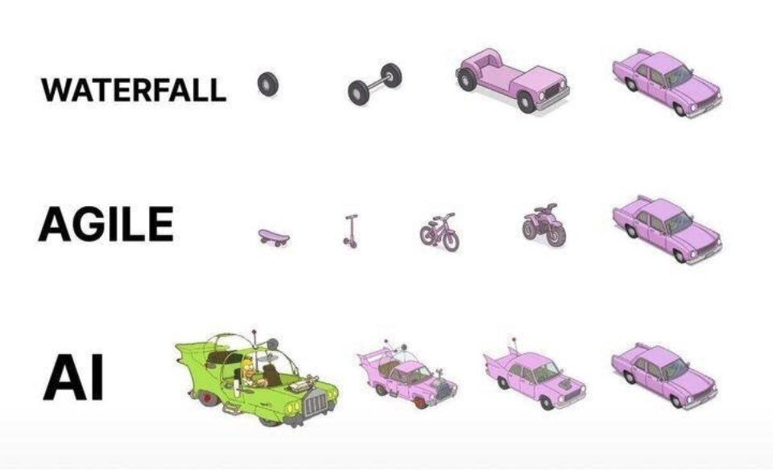
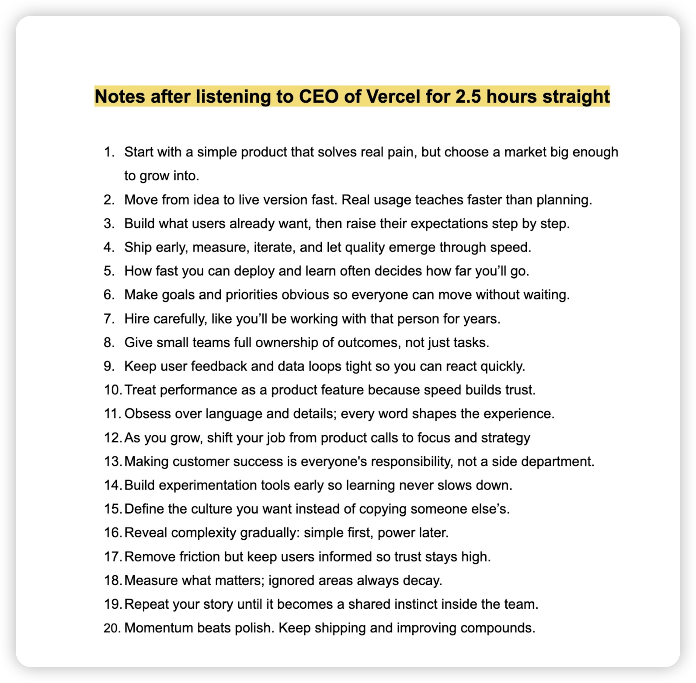

> 以事件为颗粒度，收录了一些产品哲学，希望对你有帮助！
---

## PLG---霄凡分享

1. Acquisition：

SEM(Search Engine Marketing)：付费流量

SEO(Search Engine Optimizing)：免费流量

SEO是为了获得机器青睐，必须要重视起来。核心：关键词（你是干什么的？）、权重。

效果：做了就有收获，coohom做了半年，就增长了10倍。

梳理出关键词、H标签等信息是产品经理的基本功，甚至可以利用热点词来获取流量。在SEO的过程中，是你了解产品最简单、最符合直觉的方式。

## 苏杰-AI产品创新

1. AI产品创新会更大概率出现在硬件，用户与软件的交互需要载体；
2. 工具型产品（携程）的价值会被降低，会管道化、会被AI代理掉；
3. 交互范式会从用户->产品 到 用户->agent->产品，产品会退化为隐藏能力；

## Pokee.ai 朱哲清

1. 采用目标驱动式思考方式，而不是走一步看一步
2. 强化学习模型本质上为决策而设计
3. 别人的大语言模型，外面加一层RL层，做出来的agent无法达到商用级别的精度和鲁棒性
4. 有一半的精力用于research，写代码
5. 未来网络中的接口会是：Agent to Agent

## Mike Krieger-红杉资本访谈

1. AI产品区别于传统产品，其定义需要自下而上，最懂模型的人来做产品决策更合适；

## Vibe Coding应该怎样做？

Vibe Coding的最佳实践仍然是Agile的版本迭代模式。例如你要做一个ERP系统，分成若干版本来迭代，每个版本都是独立稳定运行的。这样你基本可以保证，做出来的东西是可控的。

- v0.1: 一个可以运行的 Nextjs/TanStack 程序，有欢迎页面，可以跳转
- v0.1: 实现 users 相关数据库访问功能，在 mysql 中创建 users 表，实现 users 表的读写功能，添加读写功能的测试代码
- v0.2: 实现用户注册的网页，连接 users 相关数据库方法，能写入注册用户信息到数据库
- v0.3: 实现用户登录、注销的网页功能
- v0.4: 实现简单的 dashboard 页面
- v0.5: 实现 products 相关数据库访问功能，写功能代码和测试
- v0.6: 实现 products 在 dashboard 的管理页面，能显示列表
- v0.7: 实现 products 的添加、编辑和删除功能

Q：Waterfall的问题是什么？

A：瀑布流通常指的是各自开发很久、联调很久的情况

## 苹果和微信在AI上的落后？

**苹果**

Apple Intelligent的延期以及噱头大于实质的体验，很多YouTube数码KOL在不同程度上表达了对Apple Intelligent的失望。

**微信**

微信看起来做了很多AI动作，概括起来就两个层面。第一个层面，单一功能的AI化，例如公众号AI朗读、微信读书支持AI总结等；第二个层面，接入头部大模型产品，比如搜索接入deepseek、将元宝加入通讯录。

**落后原因**

- 两家公司对于隐私的重视
- 产品功能的克制，注重应用

## 2025.6.13 苹果高管圆桌

**苹果AI哲学**

Apple Intelligence不是一个聊天机器人(chatbot)，Siri也不是，苹果从来没想做聊天机器人。苹果的理念是将智能深度集成到所有平台的体验中(pervasive)，让它在用户需要的地方随时出现，而不是让用户“为了完成任务而去到一个专门的聊天界面”。它的意义在于让你每天做的事情变得更好。

**Apple Intelligent三大亮点**

- fundamental model framework：让三方开发者调用设备上的模型；
- 无处不在的实时翻译：诠释了AI集成到所有平台的体验中 这一理念；
- 屏幕视觉智能

## 微信的成功

**小程序**

2017年1月9日，十年前，乔布斯发布了第一代iPhone。小程序的走向可以用常用的Gartner曲线来形容，一开始引发无限的想象，热情和投入达到高点，然后在未达到预期后出清，接着再实现稳步的增长。微信的小程序有多么成功？看看支付宝和抖音的小程序吧。

**视频号**

视频号起初只有一二十人的团队。什么叫“大处着眼、小处着手”？（战术后仰）

> “这是微信团队自己的一种风格，做一个新东西最好是一个小团队悄悄做，而不是大张旗鼓变成一个大项目，我们给自己目标，我们要做一定要做成它，所以这种压力是来自内在的，而不是任务式。”                           ———张小龙

起初，冷启动导致没有足够的内容可以推荐，一度陷入死循环。随后，微信开始了小步快跑动作，例如全面打通直播、公众号、小程序、视频号。

## 轻产品

轻产品是AI生成的产品，prompt就是PRD。轻产品是一种可交互的内容，和一篇文字、一个视频没本质区别，都是信息的呈现方式，他们之间可以轻松的互相转化，比如，帮儿子把一张需要背诵的单词表变成一个学英语的贪吃蛇小游戏。

## [Stanford 产品面试](https://youtu.be/wVMDUbsZCHs?si=4PQxuHcgZkXfCXDy)

1. 面试问题：估算市场规模

拆解为多个piece：size of market->user segments->estimate the frequency of the action。采用自上而下或自下而上的估算方法。例如，美国汉堡市场规模有多少？可以拆解为：美国吃汉堡的人有多少？每人每天或每周平均吃几个汉堡？

2. 面试问题：How would you design an oven for a person in a wheelchair?

不要直接设计产品功能，而是先从**询问面试官需求**开始（或者做假设，避免问过多的问题），包括：目标、挑战以及用户，再给出解决方案。解决方案中，包含优先级、权衡过程、MVP以及为什么

3. 举一个产品失败的例子，以及团队如何处理及二次发布的

要举一个真实例子（可以将思路交给gpt润色为一个故事）面试官主要考察resilience和collaborative能力，以及你从中获得的成长

4. 你如何衡量一个产品的成功？

要看产品的生命周期在哪个阶段。可以根据Pirate Metrics Framework(AARRR)来回答，即Aquisition、Activation、Retention、Revenue、Referral。

## 一些问题

Q：现有的AI编程产品为什么都是以 cli 的形态，例如 claude code Codex and gemini cli？cursor 、 windsurf 等通过代码编辑器的方式，为什么显得落后了？

## Vercel CEO Talk

## Gemini成功的背后---Woodward

Nano-banana 的多图融合带来的趣味性，让 gemini 的用户数腾飞， gemini 应用的月活跃用户从 3 月的 3.5 亿飙升到 10 月的 6.5 亿。这背后的战略是：避开时下火热但容易引发伦理争议的「AI 情感伴侣」方向，坚持将 gemini 定位为提升工作效率的超级工具。谷歌给 gemini 制定的考核标准并非用户粘性或时长，而是帮助用户完成了多少实际任务。

NotebookLM背后的 idea 来自于 Google labs 的一个产品经理，开发了一个 Project Tailwind 原型，支持用户上传文档、 PDF 、视频，然后由 AI 提炼要点、生成摘要和见解。 Woodward 发现后，认为这是很好的idea，于是，他决定让 4-5 个工程师和一个真正的作家碰在一起，做这款笔记软件。**作家可以从职业写作者整理信息的工作流**。

## Claude Code揭秘---Boris&Cat

### Claude Code起源

Boris在做原型的时候，想在终端中做一个小聊天应用。终端的优势是不用写 UI

然后他往里面加工具，给模型 bash 权限

### Dual-use

很多 agent 架构的第一反应是给模型封装一堆工具，find_file, web_search, open_file。但Claude Code **核心就是 bash**

原因有两个：一是用户体验更清晰——用户看到的输出，模型也能看到；二是权限管理更简单——如果用户的配置文件禁止读某个目录，bash层面就能统一拦截。

“工程师能做的事，Claude Code 都能做。”

模型在不断进化，工具越少越好。

### 内部如何使用 Claude Code

**Slash Commands**

- /commit 和 /pr
- /feature-dev
- /code-review
- /security-review

预设允许的工具调用权限，不需要每次 allow

**bash mode**

! 竟然是Claude 自己想出来的办法

**plan mode**

模型与用户对齐需求

**一种反直觉使用方式**

当你不确定要什么的时候，让 Claude 先跑一遍，看它怎么做、哪里出错，用这些错误想清楚真正的需求。

**什么时候用 subagent**

- 大规模迁移，map-reduce（先分发任务，再汇总结果）
- code-review，每个 subagent 检查安全、性能、过度设计等不同维度

subagent 的价值在于不相关的context window

**Compound Engineering**

这是Every团队实践出来的核心理念：在传统工程中，每加一个功能，下一个功能就更难做；在compound engineering中，每加一个功能，下一个功能反而更容易。

秘诀在于，每次开发教训回馈到系统里：

- 模型每犯一个错误，写进 Claude.md
- 反复检查的规则，让 Claude 写成 lint rule
- 测试用例，100%由 Claude 编写

### advice for builder

- solve your own problem

- latent demand

- 克制的产品功能

### Q&A

Q1: Claude Code和其他AI编程工具的本质区别是什么？

区别在于权限层级。Copilot和Cursor是"建议者"，活在IDE里，只能看到你展示的内容；Claude Code是"同事"，直接在终端里运行bash，拥有和你一样的系统权限。你定义目标，它处理实现。

Q2: 如何判断什么任务该用plan mode？

标准很简单：以前需要几小时工程时间的任务，用plan mode。能一次搞定的就直接说。如果你不确定，让Claude先跑一遍看它怎么失败，用失败来帮你写更好的规格说明。

Q3: Anthropic内部70%工程师日用Claude Code，他们的核心工作流是什么？

四步循环：Plan（agent读issue、研究方案、输出计划）→ Work（agent写代码和测试）→ Review（人类审查输出和教训）→ Compound（把教训写回系统，让下次更好）。

## [Manus 季逸超采访](https://youtu.be/UqMtkgQe-kI?si=I4ytaTIYapb4wPiy)

### Manus 灵感💡

看到很多非工程师用 cursor 写博客、做调研，但 cursor 太专业了，我们就想做一个通用的 agent 。

### 为什么做通用 agent

Manus 的本质是：**通用模型**+**计算机**，每个 session 背后都有一个单独隔离的虚拟机沙盒。底层这两个技术供给是通用的，走垂直就是在上面加约束。

我们做通用 agent ，用户会做各种各样的任务，慢慢地我们发现用户喜欢做 slides，那就让产品团队优化这个方向。

第二，我们想解决长尾 query，一旦长尾问题被解决，用户对产品的信任度就会更高。

第三，agent 太聚焦意味着使用场景窄，使用频次就会低。

### 主流大模型各自的优势

Manus应用做得好， tokens 使用量大，就可以给模型厂商提需求，从而减少自己 research 的带宽。

各家大模型各有优势。anthropic 的 agentic coding 还是最好的；gemini在多模态的理解，多模态的输入方面断层级领先，同时 Google 还有些资源优势；openAI在纯推理方面的reasoning领先很多；

### Manus 优势究竟是什么

1. 能根据不同场景，提供不同模型，始终给用户提供**最好的体验**；
2. 模型厂商一旦是垂直整合的，迭代速度一定没有 Manus **快**；

Q：为什么大模型公司做分化，而应用层公司做综合？

A：这和模型公司的基因有关。智能的提升是依赖用户数据的，尤其是 agent 这类长链路的，用户是非常关键的。用户的使用轨迹、 feedback 是留在应用层，而不是模型层，应用层公司（windsurf 、cursor）都有自己的数据飞轮，未来他们会以模型的形式体现出产品可以持续迭代。

### Manus 用户画像

- 互联网公司里非程序员、远程工作者
- freelancer 、solo-entrepreneur
- 金融和咨询行业的人

agent 背后不是工具，而是一个人

### Manus 数据飞轮

- 基于collective feedback 达到一种在线学习的效果；

  chatbot 输出不满意的结果时，用户会 retry 或修改提示词。但当agent失败时，用户会教 agent 怎么怎么做，系统就获得了更多的用户共识。这个过程，不涉及修改模型，parameter-free。

- 基于用户最朴素的反馈（人为打分 1-5 星）；

  agent 的自动Evaluation还有很多要改善的。Evaluation 好的并不一定受用户欢迎。比如，用户希望这个网站是好用、易用的，这个没办法 verify 。

### Manus关注的几个指标

先后顺序

1. coding 能力
2. browser use（多模态能力）
3. 广义的 tool call

还有一些无法追踪的指标，比如一个很有意思的，模型意识到错误的能力。

错误分为低纬度、高纬度两种。低纬度是指，写代码修复 bug 的时候引入另一个 bug；高纬度是指，做出来一个**可用**的东西，但不好用。Manus 应对这种错误的方式是：**再往前做一步**。例如，Manus 做完一个网页，并没有结束，而是自己用浏览器玩一圈，去校验数据正确性。

### Point0

AI 产品同最新大模型一起发布，这种策略叫模型的溢出

### Point1 

产品驱动比技术驱动，整体节奏会更快。产品迭代成本更低，可以先发出去看看有没有什么问题；而技术/模型上要更慎重，比如模型训练中的 training run，按一下要几十万美金。

### Point2

开发 agent 不就是Context Engineering 嘛（战术后仰）

### Point3

Monica 类似于生鱼片，几乎不加工；Manus 类似于水煮鱼。

chatbot核心要素是用户和模型，用往复的方式去交互；agent 多了一个 runtime，runtime 极其复杂。

### Point4

AI让生产力大幅提升，**不做什么**显得尤为重要。很多 agent 都在想增加什么 tool，而 Manus 在想这个 tool 能不能去掉。

### Point5

Manus包含三部分：用户、 runtime 、模型， 其中runtime最重要，Manus 选择的是一台虚拟机，一次性的沙盒。

- **Sandbox Scaling**非常重要，决定了agent 的并行能力。
- 没选择 Docker 这种绑定 Linux 的容器技术，而是firecracker进行虚拟化，所以 Manus 可以操作 Windows

### Point6

chatbot估价：基于input tokens 和 output tokens成本去计算。input tokens 是 prefilled 的，可以并行计算；而 output tokens 是 decoding，成本更高。 **in/out一般按 3:1计算** 

Manus根据 task type，它的 in/out 一般在 100:1 到 1000:1之间浮动

### Point7

对于太长的上下文，要让模型具有compress awareness

### Point8

Universal agent，把输入交给用户；Vertical agent，要在输入上做很多功课。

未来，垂直领域的 agent 会百花齐放，尤其是 ToB，北美更喜欢做 ToB 。

### Point9

做 agent 的思路：给剪辑师做一个剪辑 agent 非常困难，整个剪辑 workflow 但凡有一个环节不通，那就是 0。所以应该做一个给非剪辑师但却有剪辑需求的人做的agent。

**enhance people** instead of replace people

### Point10

Manus 服务的是有高价值需求的用户，与使用 chatbot的用户不冲突。Agent 用户是 Chatbot 用户的子集。
