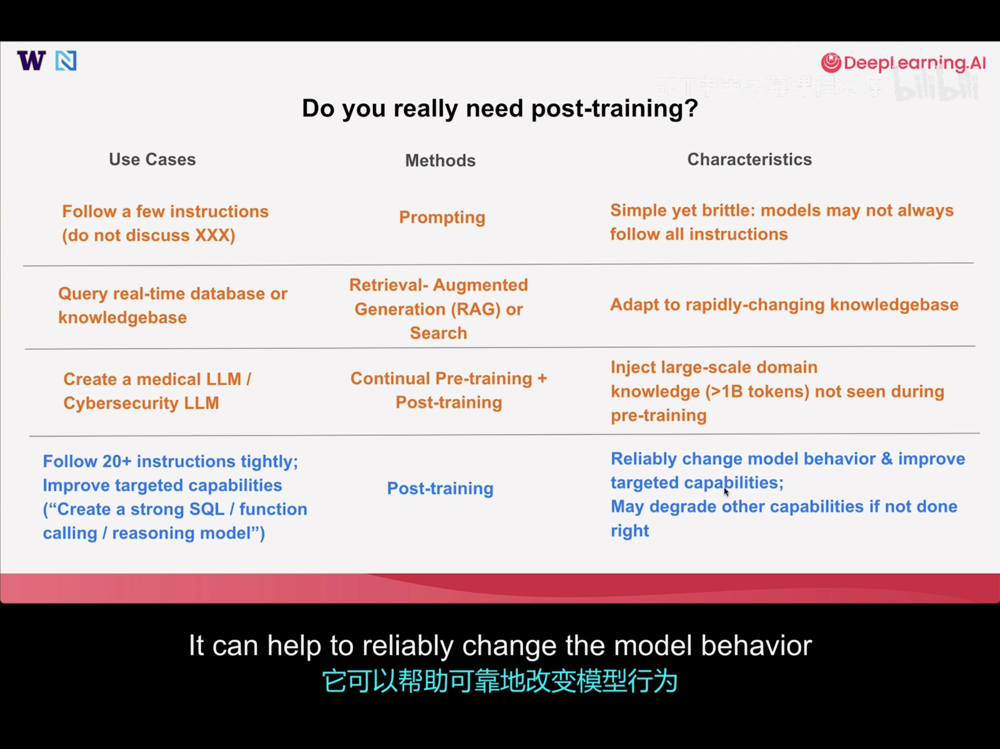
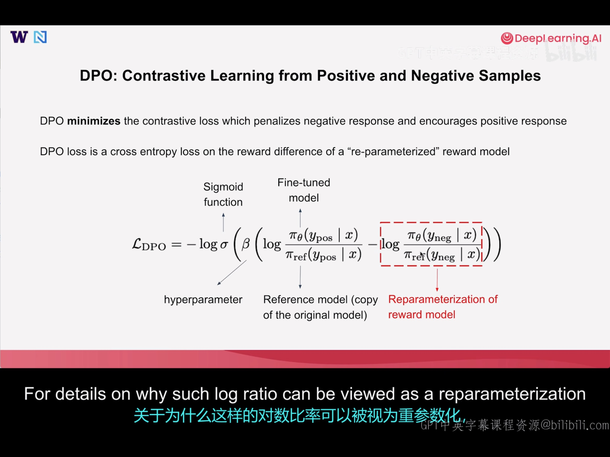
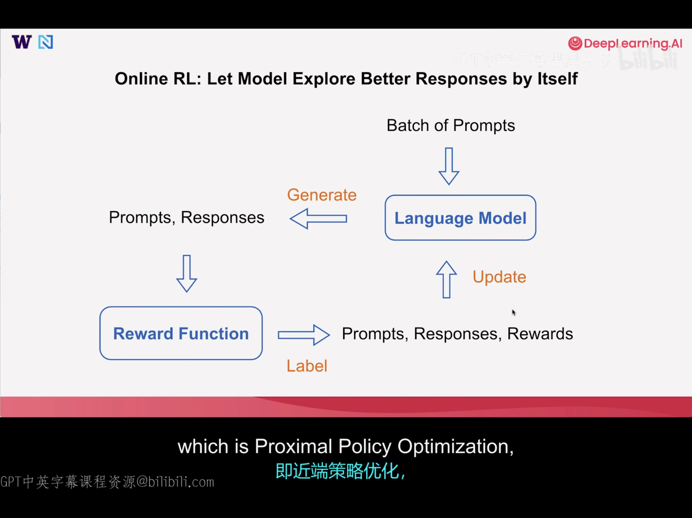
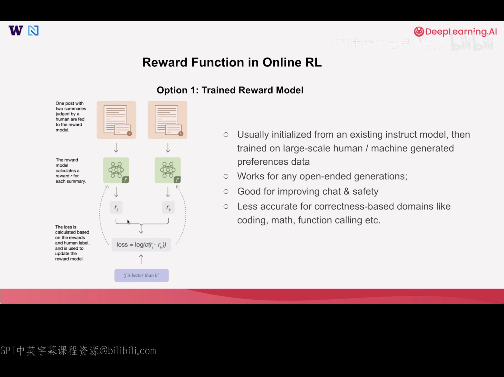
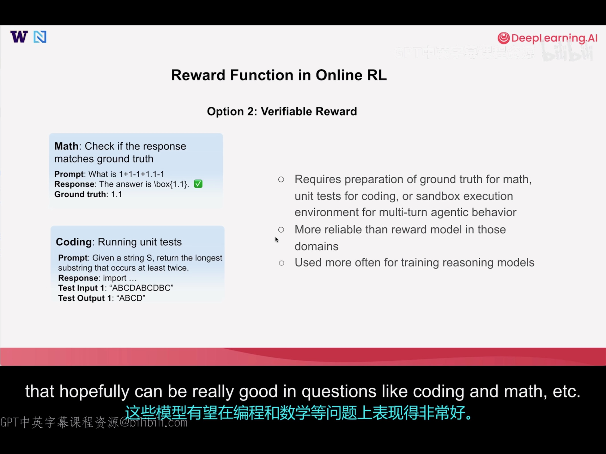
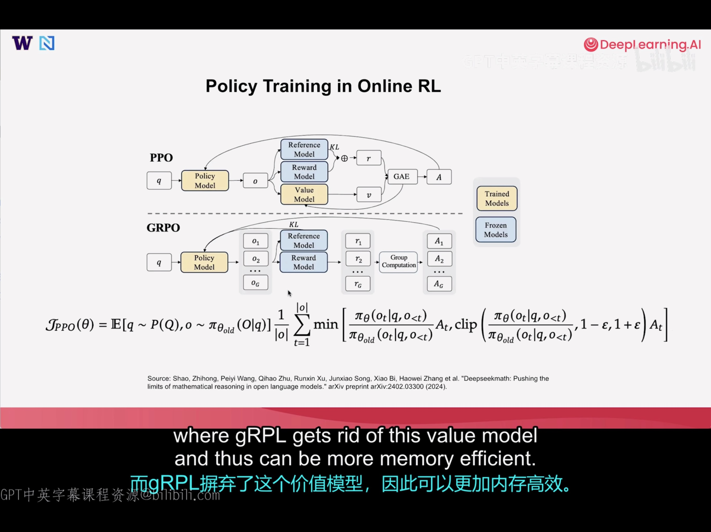

# Post-Training lesson from DeepLearning.AI

## Intro

Pre-training：喂数据，让模型学会 predict next token，输出Base Model

Post-training：让模型学会 chat，或完成指定任务，输出Chat/Instrct Model

(Continual) Post-training: 让模型在某个领域成为专家，Changing behaviors or enhancing capabilities，输出 Customized Model

后训练的三种方法

- SFT (Supervised Fine Tuning) : 数据集由Labeled Prompt-Response Pairs 组成，帮助它学习遵循指令或使用工具。SFT对引入新行为和对模型做重大更改非常有效。
- DPO (Direct Preference Optimization) : 数据集由 Prompt + Good and Bad Responses组成，让它靠近好的回答，远离坏的回答。
- RL (Reinforcement Learning) :  Prompt + Reward Function，奖励函数会对每个 prompt 生成的 response 进行打分，LLM 会根据分数调整权重，以生成更好的回答。

## Do you really need post-training

## SFT

可以从任意模型开始，可以是 BaseModel

### Best Use Cases for SFT

- Jumpstarting new model behavior
  - Pre-trained models -> Instruct Model
  - Non-reasoning models -> reasoning models
  - Let the model uses certain tools without providing tool descriptions in the prompt
- Improving model capabilities
  - Distilling capabilities for small models by training on high-quality synthetic data generated from larger models

### Principles of SFT Data Curation

- Common methods for high-quality SFT data curation
  - **Distillation:** Generate responses from a stronger and larger instruct model
  - **Best of K / rejection sampling:** Generate multiple responses from the original model, select the best among them
  - **Filtering:** start from larger scale SFT dataset, filter according to the quality of responses and diversity of the prompts
- **Quality > quantity** for improving capabilities
  - 1,000 high-quality, diverse data > 1,000,000 mixed-quality data

### Full Fine-tuning vs Parameter Efficient Fine-tuning

FFT 的 Delta W 是一个 d by d 的矩阵，PEFT 的 BA 是一个 d by r, r by d 的矩阵，r 通常远小于d。 PEFT 需要更新的参数只有B, A两个矩阵，size 远小于 FFT，这在梯度计算过程中节省了大量内存，并且计算更高效。

FFT和PEFT都可以被用在三种后训练的方法中。

### SFT Practice

标准训练学习率：8e-5

之前[微调过Gemma_3_270M](https://colab.research.google.com/github/google-gemini/gemma-cookbook/blob/main/Demos/Emoji-Gemma-on-Web/resources/Fine_tune_Gemma_3_270M_for_emoji_generation.ipynb#scrollTo=a110dfce)，使用 QLoRA实现 text2emoji

## DPO(Direct Preference Optimization)

可以从任意模型开始，通常是Instruct Model。例如通过 DPO 更改 LLM 的 identity

### Cross-Entropy Loss（交叉熵损失）

交叉熵损失用来衡量模型**预测的概率分布和真实概率分布**之间的差距，差距越大，损失越高。

DPO 旨在惩罚 negative response，鼓励positive response 

### Sigmoid 函数

将任意实数，压缩到 0-1 之间的一个函数。

与 Softmax 函数的区别：Softmax 函数要归一化，Sigmoid 不需要

DPO-Loss Function

### Best Use Cases for DPO

- Changing model behavior
  - Making small modifications of  model responses
    - Indentity
    - Multilingual
    - Instruction following
    - Safety
- Improving model capabilities
  - Better than SFT in improving model capabilities due to contrastive nature
  - Online DPO is better for improving capabilities than offline DPO

### Principles of DPO Data Curation

- Common methods for high-quality DPO data curation
  - **Correction**（纠正）: Generate responses from original model as negative, make enhancements as positive response
    - Example: I'm Llama (Negative) -> I'm Athene (Positive)
  - **Online / On-policy**: Your positive & negative example can both come from your model's distribution. One may generate multiple responses from the current model for the.same prompt, and collect the best response as positive sample and the worst response as the negative 
    - One can choose best / worst response based on **reward functions** / **human judgement**
- Avoid overfitting
  - DPO is doing reward learning with can easily **overfit to some shortcut** when the preferred answers have shortcuts to learn compared with the non-preferred answers
    - Example: when positive sample always contains a few special words while negative samples do not（在这种数据集上训练是脆弱的，可能需要更多的超参数调优才能使DPO 在这里正常工作）

## Online RL

### Online vs Offline

Online

The model learns by generating new responses in real time

Offline

The model learns purely from a pre-collected prompt-response(-reward) tuple

### Online RL: Let Model Explore Better Responses by Itself

Update步骤有多种算法，常见的包括PPO(Proximal Policy Optimization), GRPO(Grouped Relative Policy Optimization)

### Reward Function in Online RL

#### Option 1: Trained Reward Function

- Usually initialized from an existing instruct model, then trained on large-scale human / machine generated preference data
- Works for any open-ended generations
- Good for improving chat & safety
- Less accurate for correctness-based domains like coding, math, function calling etc.

#### Option2: Verifiable Reward

适用场景和特点，见图中右侧部分

### Policy Training in Online RL

Both PPO and GRPO are very efficient online RL algorithms! 

第一版 ChatGPT 使用的是 PPO；GRPO 由 deepseek 首创，用在后续的 deepseek 模型中。

#### GRPO(Only assigning credits to full responses instead of individual token)

- Well-suited for binary (often correctness-based) reward
- Requires larger amount of samples
- Requires less GPU memory (no value model needed)

#### PPO(Value model for evaluate every token advantage)

- Works well with reward model or binary reward
- More sample efficient with a well-trained value model
- More GPU memory (value model)

## Conclusion

| Methods   | Principles                                                   | Pros & Cons                                                  |
| --------- | ------------------------------------------------------------ | ------------------------------------------------------------ |
| SFT       | Imitate the example responses by maximizing the probability of the response | Pros: simple implementation, great for jump-starting new model behavior Cons: may degrade other performances for tasks not included in training data |
| Online-RL | Maximize the reward for the response                         | Pros: Better at improving model capabilities without degrading  performance in unseen tasks Cons: most complex implementation, requires good design of reward functions |
| DPO       | Encourage good answer while discouraging bad answer provided | Pros: train model in a contrastive fashion; good at fixing wrong behaviors and improving targeted capabilities Cons: may be prone to overfitting; implementation complexity in between SFT & Online RL |

SFT引入了外部的 example，模型更新权重后，对于非数据集内的问答，回答会跑偏，也就是所谓的性能降低。而 RL 的reward-update 过程，都是在模型native manifold，性能不会下降太多。

